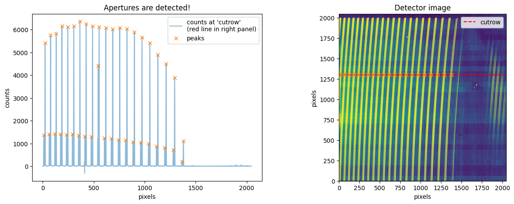
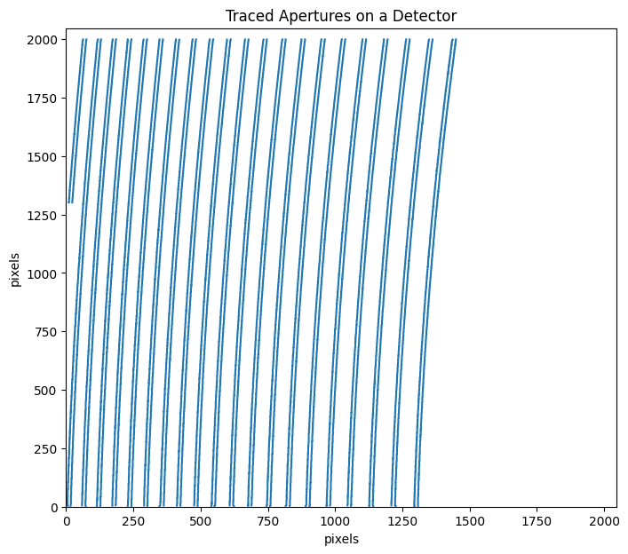
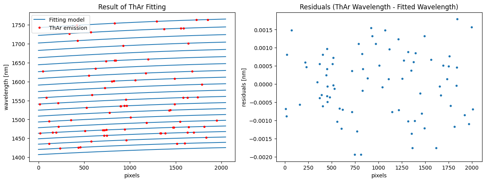
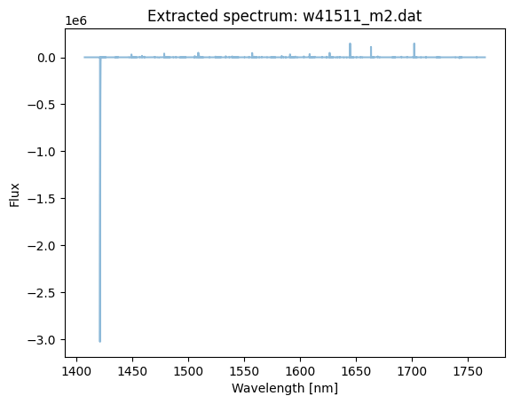
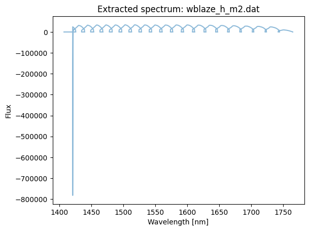
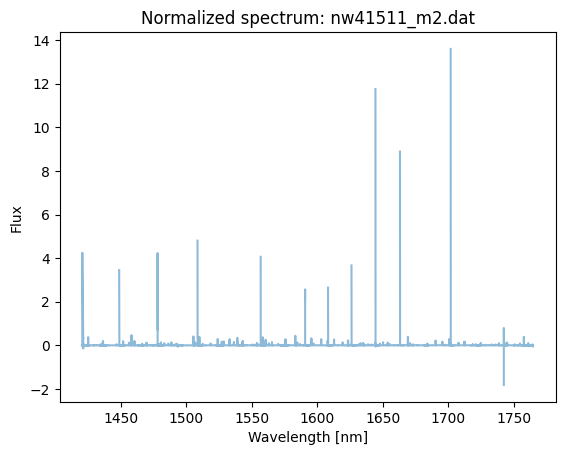
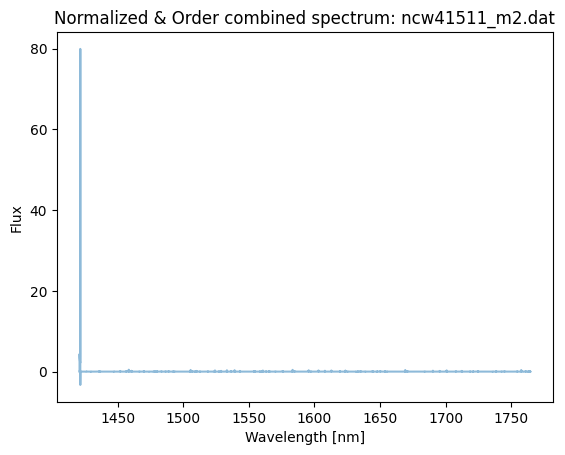

Pipeline to Get 1D Spectra from Raw Data (IRD Stream)
=====================================================

This tutorial demonstrates how to reduce raw data to
wavelength-calibrated 1D spectra. By using the ``Stream2D`` framework,
you can apply functions to multiple FITS files efficiently.

The same pipeline is available in
`examples/python/IRD_stream.py <https://github.com/prvjapan/pyird/blob/master/examples/python/IRD_stream.py>`_.
For REACH data, refer the script available in
`examples/python/REACH_stream.py <https://github.com/prvjapan/pyird/blob/master/examples/python/REACH_stream.py>`_.

- :ref:`step0`
- :ref:`step1`

  - :ref:`step1-1`
  - :ref:`step1-2`
  - :ref:`step1-3`
  - :ref:`step1-4`

- :ref:`step2`

  - :ref:`step2-1`
  - :ref:`step2-2`
  - :ref:`step2-3`
  - :ref:`step2-4`
  - :ref:`step2-5`

.. _step0:

Step 0: Settings
----------------

Directory Structure
~~~~~~~~~~~~~~~~~~~

First, specify the path to the raw data directory (``datadir``) and the
output directory (``anadir``)

This tutorial assumes the following directory structure:

::

   .
   └── pyird/
       └── data/
           └── 20210317/
               ├── flat
               ├── thar
               ├── target
               ├── dark
               └── reduc

In this structure, the flat, thar, target, and dark directories are part
of the ``datadir``, each containing raw data for ‘Flat’, ‘ThAr’,
‘Target’, and optionally ‘Dark’ frames (see also :doc:`../input_data`).
The reduc directory is used as
``anadir`` for storing processed data.

.. code:: ipython3

    import pathlib
    basedir = pathlib.Path('~/pyird/data/20210317/').expanduser()
    
    datadir_flat = basedir/'flat/'
    datadir_dark = basedir/'dark/'
    datadir_thar = basedir/'thar'
    datadir_target = basedir/'target/'
    anadir = basedir/'reduc/'

Specify the Data to be Analyzed
~~~~~~~~~~~~~~~~~~~~~~~~~~~~~~~

Please change the following variables based on the data you want to
analyze. The sample data can be downloaded from the
`Zenodo repository <https://zenodo.org/records/14614004>`_

.. code:: ipython3

    band = 'h' #'h' or 'y'
    mmf = 'mmf2' #'mmf1' (comb fiber) or 'mmf2' (star fiber)
    readout_noise_mode = 'default'

.. note::

  Ensure that the ``readout_noise_mode`` is set to either ‘real’ or
  ‘default’.

  - ``readout_noise_mode = 'real'``: Need to reduce the dataset with
    ``band = 'y'`` and ``mmf = 'mmf1'`` at first.

    - With this setting, uncertainties and signal-to-noise ratio at each
      wavelength will be included in the output files (**nw…\_m?.dat**
      and **ncw…\_m?.dat**).
    - Those values are based on the readout noise (RN) calculated using
      the comb spectrum (in mmf1) of the Y/J band.

  - ``readout_noise_mode = 'default'``: Uses a default readout noise (RN)
    value (RN=12 :math:`e^{-}`).

Please also specify the ``fitsid`` corresponding to the file you wish to
analyze. For files starts with ‘IRDA000’, set even-numbered fitsid
values.

By default, the ``band`` parameter determines which band’s data to
process. However, the pipeline is designed to safely handle cases where
you also change the FITS IDs accordingly (to an odd number) when
reducing the H-band data with ``band='h'``. See also
:ref:`terms-filename`.

.. code:: ipython3

    # last 5 digits of FITS file numbers: [start, end file number]
    flat_comb_id = [41704, 41803]  # flat image for comb
    flat_star_id = [41804, 41903]  # flat image for star/target
    dark_id = [41504, 41505] # dark image
    thar_id = [14632, 14731] # ThAr image
    target_id = [41510, 41511] # target image

.. _step1:

Step 1: Preprocessing the Calibration Dataset
---------------------------------------------

.. _step1-1:

Step 1-1: Identifying Apertures (Spectral Orders)
~~~~~~~~~~~~~~~~~~~~~~~~~~~~~~~~~~~~~~~~~~~~~~~~~

- The ``aptrace`` function is used to identify apertures.
- Number of apertures (``num_aperture``): 42 for H band, 102 for Y/J band.
- ``search_start_row`` sets the initial row number on the detector image for
  searching apertures.
- These apertures are identified in the FLAT_COMB data.
- If your observation was performed with a single fiber, set ``num_aperture`` to
  half the default value.

.. code:: ipython3

    from pyird.utils import irdstream
    
    ## FLAT_COMB
    # settings
    flat_comb=irdstream.Stream2D("flat_comb", 
                                 datadir_flat, 
                                 anadir, 
                                 fitsid=list(range(flat_comb_id[0], flat_comb_id[-1], 2)), 
                                 band=band)
    
    # aperture extraction
    if band=='h':
        trace_mmf=flat_comb.aptrace(search_start_row=1300, num_aperture=42) 
    elif band=='y':
        trace_mmf=flat_comb.aptrace(search_start_row=1000,num_aperture=102) 

.. parsed-literal::

    fitsid is incremented.
    Processing h band
    Processing fitsid: [41705, 41707, 41709, 41711, 41713, 41715, 41717, 41719, 41721, 41723, 41725, 41727, 41729, 41731, 41733, 41735, 41737, 41739, 41741, 41743, 41745, 41747, 41749, 41751, 41753, 41755, 41757, 41759, 41761, 41763, 41765, 41767, 41769, 41771, 41773, 41775, 41777, 41779, 41781, 41783, 41785, 41787, 41789, 41791, 41793, 41795, 41797, 41799, 41801, 41803]
    [STEP] Performing aptrace...
    Performing median combine for raw images.

.. parsed-literal::

    100%|██████████████████████████████████████████████████████████████████████████████████████████████████████████████████████████████████████████████████| 50/50 [00:00<00:00, 845.81it/s]

.. parsed-literal::

    Searching for apertures using the default num_aperture value.
    Successfully detected the required number of apertures on detector row 1301.

.. parsed-literal::

    100%|███████████████████████████████████████████████████████████████████████████████████████████████████████████████████████████████████████████████████| 42/42 [00:06<00:00,  7.00it/s]

- Define ‘trace_mask’ to mask light from both fibers.
- Aperture width is 6 pixels (from -2 to +4) for IRD data and 5 pixels
  (from -2 to 3) for REACH data by default. You can change it ``.width``
  instance of trace_mmf.

.. code:: ipython3

    trace_mask = trace_mmf.mask()

.. parsed-literal::

    100%|██████████████████████████████████████████████████████████████████████████████████████████████████████████████████████████████████████████████████| 42/42 [00:00<00:00, 169.15it/s]

- Reduce apertures in the mask to extract the spectrum from the desired
  fiber

.. code:: ipython3

    trace_mmf.choose_aperture(fiber=mmf)

.. parsed-literal::

    Processing m2 fiber.

.. _step1-2:

Step 1-2: Removing hotpixels
~~~~~~~~~~~~~~~~~~~~~~~~~~~~

- In this tutorial, we demonstrate how to identify hotpixels using dark
  images.
- If you prefer to load an existing hotpixel mask without using dark
  images, please refer to the
  `pyird.io.read_hotpix <https://secondearths.sakura.ne.jp/pyird/pyird/pyird.io.html#module-pyird.io.read_hotpix>`_
  module.
- If you are interested in comparing different hotpixel mask
  identification methods, see issue
  `#121 <https://github.com/prvjapan/pyird/issues/121>`_.

.. code:: ipython3

    from pyird.image.bias import bias_subtract_image
    from pyird.image.hotpix import identify_hotpix_sigclip
    
    ## HOTPIXEL MASK: 
    ## DARK
    dark = irdstream.Stream2D('dark', 
                              datadir_dark, 
                              anadir, 
                              fitsid=list(range(dark_id[0], dark_id[-1], 2)), 
                              band=band) # Multiple file is ok
    median_image = dark.immedian()
    im_subbias = bias_subtract_image(median_image)
    hotpix_mask = identify_hotpix_sigclip(im_subbias)

.. parsed-literal::

    fitsid is incremented.
    Processing h band
    Processing fitsid: [41505]
    Performing median combine for raw images.

.. parsed-literal::

    100%|████████████████████████████████████████████████████████████████████████████████████████████████████████████████████████████████████████████████████| 1/1 [00:00<00:00, 155.45it/s]

.. parsed-literal::

    0.58% of pixels flagged in hot-pixel mask.

.. _step1-3:

Step 1-3: Wavelength Calibration
~~~~~~~~~~~~~~~~~~~~~~~~~~~~~~~~

- Wavelength calibration is performed by using reference frames
  (Thrium-Argon).
- You do not need to manually identify emission lines;
  ``calibrate_wavelength`` automatically references the line list!

.. code:: ipython3

    ## THAR (ThAr-ThAr)
    # Settings
    if band=='h':
        rawtag='IRDAD000'
    elif band=='y':
        rawtag='IRDBD000'
    thar=irdstream.Stream2D("thar", 
                            datadir_thar, 
                            anadir, 
                            rawtag=rawtag, 
                            fitsid=list(range(thar_id[0], thar_id[-1]+1)), 
                            band=band) 
    thar.trace = trace_mmf
    
    # removing noise pattern
    thar.clean_pattern(trace_mask=trace_mask,extin='', extout='_cp', hotpix_mask=hotpix_mask)
    
    # wavelength calibration
    thar.calibrate_wavelength()

.. parsed-literal::

    Processing h band
    Processing fitsid: [14632, 14633, 14634, 14635, 14636, 14637, 14638, 14639, 14640, 14641, 14642, 14643, 14644, 14645, 14646, 14647, 14648, 14649, 14650, 14651, 14652, 14653, 14654, 14655, 14656, 14657, 14658, 14659, 14660, 14661, 14662, 14663, 14664, 14665, 14666, 14667, 14668, 14669, 14670, 14671, 14672, 14673, 14674, 14675, 14676, 14677, 14678, 14679, 14680, 14681, 14682, 14683, 14684, 14685, 14686, 14687, 14688, 14689, 14690, 14691, 14692, 14693, 14694, 14695, 14696, 14697, 14698, 14699, 14700, 14701, 14702, 14703, 14704, 14705, 14706, 14707, 14708, 14709, 14710, 14711, 14712, 14713, 14714, 14715, 14716, 14717, 14718, 14719, 14720, 14721, 14722, 14723, 14724, 14725, 14726, 14727, 14728, 14729, 14730, 14731]
    [STEP] Performing clean_pattern: output extension=_cp

.. parsed-literal::

    100%|█████████████████████████████████████████████████████████████████████████████████████████████████████████████████████████████████████████████████| 100/100 [00:59<00:00,  1.69it/s]

.. parsed-literal::

    [STEP] Performing calibrate_wavelength...
    Performing median combine for raw images.

.. parsed-literal::

    100%|███████████████████████████████████████████████████████████████████████████████████████████████████████████████████████████████████████████████| 100/100 [00:00<00:00, 2156.61it/s]
    100%|███████████████████████████████████████████████████████████████████████████████████████████████████████████████████████████████████████████████████| 21/21 [00:00<00:00, 87.16it/s]

.. parsed-literal::

    Channel mode identified: H band (21 orders).
    Std. of wavelength-data residuals after initial identification: 0.00903
    Starting ThAr fitting iterations:
        Target: std <= 0.00100 or max iteration = 30
        # 1 std = 0.01343
        # 2 std = 0.00791
        # 3 std = 0.00424
        # 4 std = 0.00267
        # 5 std = 0.00196
        # 6 std = 0.00144
        # 7 std = 0.00114
        # 8 std = 0.00090

.. parsed-literal::

    Created a new file of the ThAr spectrum with a wavelength solution: /Users/yuikasagi/pyird/data/20210317/reduc/thar_h_m2.fits

.. _step1-4:

Step 1-4: Creating a Normalized Flat
~~~~~~~~~~~~~~~~~~~~~~~~~~~~~~~~~~~~

- This process similar to
  `hdsis_ecf <https://github.com/chimari/hds_iraf>`_ for HDS/Subaru
  data to reduce the fringe appearing in a spectrum.
- In the preparation of this process, we create the normalized flat by
  using ``apnormalize``.
- After applying ``flatten``, **‘{stream_id}\_{band}\_{mmf}.fits’**
  (e.g., flat_star_h_m2.fits) is created in anadir, containing the
  extracted spectrum of flat data.

.. code:: ipython3

    ## FLAT
    if mmf=='mmf2': # Star fiber -> FLAT_STAR
        # Settings
        flat_star=irdstream.Stream2D("flat_star", 
                                     datadir_flat, 
                                     anadir, 
                                     fitsid=list(range(flat_star_id[0], flat_star_id[-1], 2)), 
                                     band=band)
        flat_star.trace = trace_mmf
    
        # Removing noise pattern
        flat_star.clean_pattern(trace_mask=trace_mask, extin='', extout='_cp', hotpix_mask=hotpix_mask)
        flat_star.imcomb = True # median combine
    
        # Extract 1D spectrum
        flat_star.flatten(hotpix_mask=hotpix_mask)
    
        # Flat spectrum normalized in each pixel within an aperture
        df_flatn = flat_star.apnormalize()
    
    elif mmf=='mmf1': # Comb fiber -> FLAT_COMB
        flat_comb.trace = trace_mmf
    
        # Removing noise pattern
        flat_comb.clean_pattern(trace_mask=trace_mask, extin='', extout='_cp', hotpix_mask=hotpix_mask)
        flat_comb.imcomb = True # median combine
    
        # Extract 1D spectrum
        flat_comb.flatten(hotpix_mask=hotpix_mask)
    
        # Flat spectrum normalized in each pixel within an aperture
        df_flatn = flat_comb.apnormalize()

.. parsed-literal::

    fitsid is incremented.
    Processing h band
    Processing fitsid: [41805, 41807, 41809, 41811, 41813, 41815, 41817, 41819, 41821, 41823, 41825, 41827, 41829, 41831, 41833, 41835, 41837, 41839, 41841, 41843, 41845, 41847, 41849, 41851, 41853, 41855, 41857, 41859, 41861, 41863, 41865, 41867, 41869, 41871, 41873, 41875, 41877, 41879, 41881, 41883, 41885, 41887, 41889, 41891, 41893, 41895, 41897, 41899, 41901, 41903]
    [STEP] Performing clean_pattern: output extension=_cp

.. parsed-literal::

    100%|███████████████████████████████████████████████████████████████████████████████████████████████████████████████████████████████████████████████████| 50/50 [00:26<00:00,  1.86it/s]

.. parsed-literal::

    [STEP] Performing flatten...

.. parsed-literal::

    0it [00:00, ?it/s]

.. parsed-literal::

    Performing median combine for raw images.

.. parsed-literal::

    
    100%|█████████████████████████████████████████████████████████████████████████████████████████████████████████████████████████████████████████████████| 50/50 [00:00<00:00, 1323.07it/s]
    
      0%|                                                                                                                                                            | 0/21 [00:00<?, ?it/s]
     48%|██████████████████████████████████████████████████████████████████████                                                                             | 10/21 [00:00<00:00, 90.86it/s]
    100%|███████████████████████████████████████████████████████████████████████████████████████████████████████████████████████████████████████████████████| 21/21 [00:00<00:00, 87.23it/s]
    
      0%|                                                                                                                                                            | 0/21 [00:00<?, ?it/s]
     48%|██████████████████████████████████████████████████████████████████████                                                                             | 10/21 [00:00<00:00, 91.26it/s]
    100%|███████████████████████████████████████████████████████████████████████████████████████████████████████████████████████████████████████████████████| 21/21 [00:00<00:00, 86.77it/s]
    1it [00:08,  8.57s/it]

.. parsed-literal::

    Created /Users/yuikasagi/pyird/data/20210317/reduc/flat_star_h_m2.fits
    [STEP] Performing apnormalize...
    Continuum successfully fitted with polynomial order = 23.
    Performing median combine for images with extension '_cp'.

.. parsed-literal::

    100%|█████████████████████████████████████████████████████████████████████████████████████████████████████████████████████████████████████████████████| 50/50 [00:00<00:00, 1622.53it/s]
    100%|███████████████████████████████████████████████████████████████████████████████████████████████████████████████████████████████████████████████████| 21/21 [00:03<00:00,  5.62it/s]

.. _step2:

Step 2: Extracting the Target 1D Spectrum
-----------------------------------------

From here, we will extract target spectrum.

.. code:: ipython3

    #--------FOR TARGET--------#
    # Settings
    target = irdstream.Stream2D('targets', 
                                datadir_target, 
                                anadir, 
                                fitsid=list(range(target_id[0], target_id[-1], 2)), 
                                band=band)
    target.info = True  # show detailed info
    target.trace = trace_mmf

.. parsed-literal::

    fitsid is incremented.
    Processing h band
    Processing fitsid: [41511]

.. _step2-1:

Step 2-1: Removing Noise Pattern on the Detector
~~~~~~~~~~~~~~~~~~~~~~~~~~~~~~~~~~~~~~~~~~~~~~~~

.. code:: ipython3

    target.clean_pattern(trace_mask=trace_mask, extin='', extout='_cp', hotpix_mask=hotpix_mask)

.. parsed-literal::

    [STEP] Performing clean_pattern: output extension=_cp

.. parsed-literal::

    100%|█████████████████████████████████████████████████████████████████████████████████████████████████████████████████████████████████████████████████████| 1/1 [00:00<00:00,  1.95it/s]

.. _step2-2:

Step 2-2: Aperture Extraction & Flat Fielding
~~~~~~~~~~~~~~~~~~~~~~~~~~~~~~~~~~~~~~~~~~~~~

- The ``apext_flatfield`` function extracts each order while applying
  flat fielding.
- This process requires the flat spectrum normalized in each pixel
  within an aperture (i.e., df_flatn).
- After this process, **’IRDA000…\_flnhp.fits’** (when
  ``hotpix_mask`` is set) or **’IRDA000…\_fln.fits’** (when
  ``hotpix_mask = None``) is created.

.. code:: ipython3

    target.apext_flatfield(df_flatn, hotpix_mask=hotpix_mask)

.. parsed-literal::

    [STEP] Performing apext_flatfield...

.. parsed-literal::

      0%|                                                                                                                                                             | 0/1 [00:00<?, ?it/s]
      0%|                                                                                                                                                            | 0/21 [00:00<?, ?it/s]
     10%|██████████████                                                                                                                                      | 2/21 [00:00<00:02,  7.81it/s]
     14%|█████████████████████▝                                                                                                                              | 3/21 [00:00<00:02,  6.56it/s]
     19%|████████████████████████████▝                                                                                                                       | 4/21 [00:00<00:02,  6.04it/s]
     24%|███████████████████████████████████▝                                                                                                                | 5/21 [00:00<00:02,  5.79it/s]
     29%|██████████████████████████████████████████▎                                                                                                         | 6/21 [00:01<00:02,  5.62it/s]
     33%|█████████████████████████████████████████████████▎                                                                                                  | 7/21 [00:01<00:02,  5.52it/s]
     38%|████████████████████████████████████████████████████████▝                                                                                           | 8/21 [00:01<00:02,  5.46it/s]
     43%|███████████████████████████████████████████████████████████████▝                                                                                    | 9/21 [00:01<00:02,  5.43it/s]
     48%|██████████████████████████████████████████████████████████████████████                                                                             | 10/21 [00:01<00:02,  5.42it/s]
     52%|█████████████████████████████████████████████████████████████████████████████                                                                      | 11/21 [00:01<00:01,  5.38it/s]
     57%|████████████████████████████████████████████████████████████████████████████████████                                                               | 12/21 [00:02<00:01,  5.37it/s]
     62%|███████████████████████████████████████████████████████████████████████████████████████████                                                        | 13/21 [00:02<00:01,  5.34it/s]
     67%|██████████████████████████████████████████████████████████████████████████████████████████████████                                                 | 14/21 [00:02<00:01,  5.33it/s]
     71%|█████████████████████████████████████████████████████████████████████████████████████████████████████████                                          | 15/21 [00:02<00:01,  5.33it/s]
     76%|████████████████████████████████████████████████████████████████████████████████████████████████████████████████                                   | 16/21 [00:02<00:00,  5.36it/s]
     81%|███████████████████████████████████████████████████████████████████████████████████████████████████████████████████████                            | 17/21 [00:03<00:00,  5.36it/s]
     86%|██████████████████████████████████████████████████████████████████████████████████████████████████████████████████████████████                     | 18/21 [00:03<00:00,  5.34it/s]
     90%|█████████████████████████████████████████████████████████████████████████████████████████████████████████████████████████████████████              | 19/21 [00:03<00:00,  5.34it/s]
     95%|████████████████████████████████████████████████████████████████████████████████████████████████████████████████████████████████████████████       | 20/21 [00:03<00:00,  5.37it/s]
    100%|███████████████████████████████████████████████████████████████████████████████████████████████████████████████████████████████████████████████████| 21/21 [00:03<00:00,  5.51it/s]
    100%|█████████████████████████████████████████████████████████████████████████████████████████████████████████████████████████████████████████████████████| 1/1 [00:03<00:00,  3.86s/it]

.. parsed-literal::

    Pixel offset from aperture center = -2 | Mean counts along aperture = 0.84721
    Pixel offset from aperture center = -1 | Mean counts along aperture = 1.35783
    Pixel offset from aperture center = 0 | Mean counts along aperture = 1.46715
    Pixel offset from aperture center = 1 | Mean counts along aperture = 1.34046
    Pixel offset from aperture center = 2 | Mean counts along aperture = 0.77173
    Pixel offset from aperture center = 3 | Mean counts along aperture = 0.17888

.. parsed-literal::

    

.. _step2-3:

Step 2-3: Assigning Wavelength to the Extracted Spectrum
~~~~~~~~~~~~~~~~~~~~~~~~~~~~~~~~~~~~~~~~~~~~~~~~~~~~~~~~

- The ``dispcor`` function assigns wavelength solution to the extracted
  spectrum.
- Please change the ``extin`` option to ``extin='_flnhp'`` or
  ``extin='_fln'`` depending on the previous process.
- After this process, **’w…\_m?.dat’** is created, with data format:
  ``$1: Wavelength [nm]``, ``$2: Order``, ``$3: Counts``.

.. code:: ipython3

    target.dispcor(master_path=thar.anadir, extin='_flnhp')

.. parsed-literal::

    [STEP] Performing dispcor...
    Allocate wavelengths based on the ThAr file: /Users/yuikasagi/pyird/data/20210317/reduc/thar_h_m2.fits
    Created 1D spectrum: w41511_m2.dat

.. _step2-4:

Step 2-4: Creating the Blaze Function
~~~~~~~~~~~~~~~~~~~~~~~~~~~~~~~~~~~~~

- The blaze function is created from FLAT spectrum to ‘’normalize’’ the
  spectra.
- After this process, **’wblaze\_{band}\_{mmf}.dat’** is created.

.. code:: ipython3

    # blaze function
    if mmf=='mmf2':
        flat_star.apext_flatfield(df_flatn, hotpix_mask=hotpix_mask)
        flat_star.dispcor(master_path=thar.anadir)
    elif mmf=='mmf1':
        flat_comb.apext_flatfield(df_flatn, hotpix_mask=hotpix_mask)
        flat_comb.dispcor(master_path=thar.anadir)

.. parsed-literal::

    [STEP] Performing apext_flatfield...

.. parsed-literal::

      0%|                                                                                                                                                             | 0/1 [00:00<?, ?it/s]

.. parsed-literal::

    Performing median combine for images with extension '_cp'.

.. parsed-literal::

    
    100%|█████████████████████████████████████████████████████████████████████████████████████████████████████████████████████████████████████████████████| 50/50 [00:00<00:00, 1312.57it/s]
    
      0%|                                                                                                                                                            | 0/21 [00:00<?, ?it/s]
     10%|██████████████                                                                                                                                      | 2/21 [00:00<00:02,  7.92it/s]
     14%|█████████████████████▝                                                                                                                              | 3/21 [00:00<00:02,  6.63it/s]
     19%|████████████████████████████▝                                                                                                                       | 4/21 [00:00<00:02,  6.12it/s]
     24%|███████████████████████████████████▝                                                                                                                | 5/21 [00:00<00:02,  5.86it/s]
     29%|██████████████████████████████████████████▎                                                                                                         | 6/21 [00:00<00:02,  5.70it/s]
     33%|█████████████████████████████████████████████████▎                                                                                                  | 7/21 [00:01<00:02,  5.60it/s]
     38%|████████████████████████████████████████████████████████▝                                                                                           | 8/21 [00:01<00:02,  5.50it/s]
     43%|███████████████████████████████████████████████████████████████▝                                                                                    | 9/21 [00:01<00:02,  5.46it/s]
     48%|██████████████████████████████████████████████████████████████████████                                                                             | 10/21 [00:01<00:02,  5.43it/s]
     52%|█████████████████████████████████████████████████████████████████████████████                                                                      | 11/21 [00:01<00:01,  5.42it/s]
     57%|████████████████████████████████████████████████████████████████████████████████████                                                               | 12/21 [00:02<00:01,  5.38it/s]
     62%|███████████████████████████████████████████████████████████████████████████████████████████                                                        | 13/21 [00:02<00:01,  5.36it/s]
     67%|██████████████████████████████████████████████████████████████████████████████████████████████████                                                 | 14/21 [00:02<00:01,  5.37it/s]
     71%|█████████████████████████████████████████████████████████████████████████████████████████████████████████                                          | 15/21 [00:02<00:01,  5.37it/s]
     76%|████████████████████████████████████████████████████████████████████████████████████████████████████████████████                                   | 16/21 [00:02<00:00,  5.35it/s]
     81%|███████████████████████████████████████████████████████████████████████████████████████████████████████████████████████                            | 17/21 [00:03<00:00,  5.36it/s]
     86%|██████████████████████████████████████████████████████████████████████████████████████████████████████████████████████████████                     | 18/21 [00:03<00:00,  5.39it/s]
     90%|█████████████████████████████████████████████████████████████████████████████████████████████████████████████████████████████████████              | 19/21 [00:03<00:00,  5.39it/s]
     95%|████████████████████████████████████████████████████████████████████████████████████████████████████████████████████████████████████████████       | 20/21 [00:03<00:00,  5.39it/s]
    100%|███████████████████████████████████████████████████████████████████████████████████████████████████████████████████████████████████████████████████| 21/21 [00:03<00:00,  5.55it/s]
    100%|█████████████████████████████████████████████████████████████████████████████████████████████████████████████████████████████████████████████████████| 1/1 [00:11<00:00, 11.84s/it]

.. parsed-literal::

    Pixel offset from aperture center = -2 | Mean counts along aperture = 0.84721
    Pixel offset from aperture center = -1 | Mean counts along aperture = 1.35783
    Pixel offset from aperture center = 0 | Mean counts along aperture = 1.46715
    Pixel offset from aperture center = 1 | Mean counts along aperture = 1.34046
    Pixel offset from aperture center = 2 | Mean counts along aperture = 0.77173
    Pixel offset from aperture center = 3 | Mean counts along aperture = 0.17888
    [STEP] Performing dispcor...
    Allocate wavelengths based on the ThAr file: /Users/yuikasagi/pyird/data/20210317/reduc/thar_h_m2.fits
    Created 1D spectrum: wblaze_h_m2.dat

.. _step2-5:

Step 2-5: Normalizing the Spectra
~~~~~~~~~~~~~~~~~~~~~~~~~~~~~~~~~

- Normalize the target spectrum by dividing it by the blaze function.
- After ``normalize1D``, the normalized spectrum (**nw…\_m?.dat**)
  and the order-combined spectrum (**ncw…\_m?.dat**) are created.

  - Data formats are:

    - Normalized (**nw**): ``$1: Wavelength [nm]``, ``$2: Order``,
      ``$3: Counts``, ``$4: S/N``, ``$5: Uncertainties``
    - Order-combined (**ncw**): ``$1: Wavelength [nm]``, ``$2: Counts``,
      ``$3: S/N``, ``$4: Uncertainties``

- For the order-combined spectra: There are overlapping wavelengths at
  the edges of orders, so we “normalize” by summing up the flux in these
  regions to improve the signal-to-noise ratio.

.. code:: ipython3

    # combine & normalize
    if mmf=='mmf2':
        target.normalize1D(master_path=flat_star.anadir, readout_noise_mode=readout_noise_mode)
    elif mmf=='mmf1':
        target.normalize1D(master_path=flat_comb.anadir, readout_noise_mode=readout_noise_mode)

.. parsed-literal::

    [STEP] Performing normalize1D...
    Using default readout Noise : 12
    readout noise of IRD detectors: ~12e- (10min exposure)
    Created normalized 1D spectrum: nw41511_m2.dat
    Created normalized & order-combined 1D spectrum: ncw41511_m2.dat

This concludes the data reduction process!

See :doc:`./plot_spec` and :doc:`./other_outputs` for detailed
explanations of output spectra.
