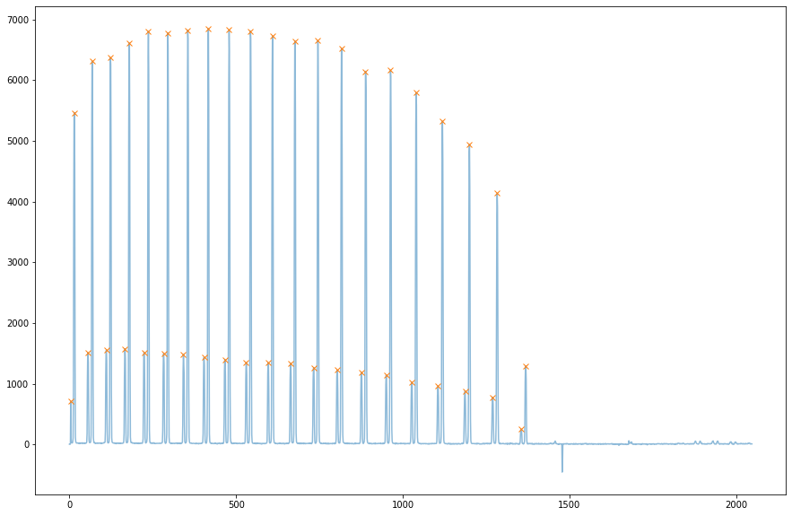
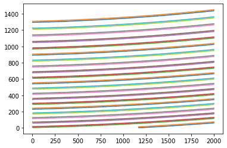
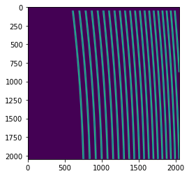
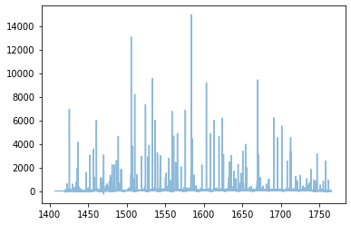
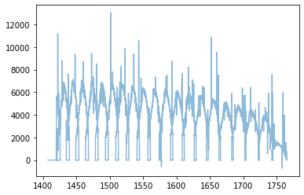
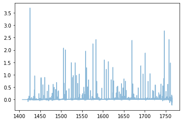
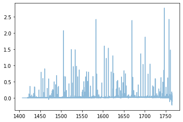

IRD stream
==========

By using the framework of ``Stream2D``, you can apply functions into
multiple fits files. Here, we try to reduce from raw data to wavelength
calibrated spectra.

Start by setting a path for the directory which contains raw data of
‘Flat’, ‘ThAr’, and ‘Target’ (and ‘Dark’, optionally).

.. code:: ipython3

    import pathlib
    basedir = pathlib.Path('~/pyird/data/20210317/').expanduser()

Preprocessing of calibration dataset
------------------------------------

Set the directory and frame numbers for ‘Flat’ to search for reference
apertures for spectrum extraction.

-  It would be better to use FLAT_COMB data (flat light injected to the
   LFC fiber) because lights can be found in both fibers so that there
   is no need to change frame IDs when switching fiber to analyze.
-  Frame numbers can be set the even numbers. When analyzing H band,
   they are increased by one by using ``fitsid_increment()``.

.. code:: ipython3

    from pyird.utils import irdstream
    ### FOR CALIBRATION ###
    # aperture extraction
    datadir = basedir/'flat/'
    anadir = basedir/'reduc/'
    flat=irdstream.Stream2D("flat",datadir,anadir)
    flat.fitsid=list(range(41704,41804,2)) ##FLAT_COMB

.. parsed-literal::

    No fitsid yet.

Then, select the band to analyze (‘y’ for YJ band or ‘h’ for H band).

.. code:: ipython3

    flat.band='h' #'h' or 'y'
    print(flat.band,' band')

.. parsed-literal::

    h  band

The function ``aptrace`` searches apertures to be traced.

-  The number of apertures is specified by ``nap``, which should be set
   42 (or 21) for H band and 102 (or 51) for YJ band.
-  The apertures begin its search at ``cutrow``, which is the row number
   of the detector (wavelength direction), and continue in the direction
   of increasing numbers until it matches the appropriate number of
   apertures. You may as well change the value of ``cutrow`` if the
   aperture trace is failed.

.. code:: ipython3

    if flat.band=='h':
        flat.fitsid_increment() # when you use H-band
        trace_mmf=flat.aptrace(cutrow = 800,nap=42) #TraceAperture instance
    elif flat.band=='y':
        trace_mmf=flat.aptrace(cutrow = 1000,nap=102) #TraceAperture instance
    trace_mask = trace_mmf.mask()

.. parsed-literal::

    100%|████████████████████████████████████████████████████████████████████████████████████████████████████████████████| 50/50 [00:00<00:00, 336.90it/s]

.. parsed-literal::

    cross-section: row  1170

.. parsed-literal::

    100%|█████████████████████████████████████████████████████████████████████████████████████████████████████████████████| 42/42 [00:12<00:00,  3.46it/s]

.. parsed-literal::

    100%|████████████████████████████████████████████████████████████████████████████████████████████████████████████████| 42/42 [00:00<00:00, 103.88it/s]

Show trace mask.

.. code:: ipython3

    import matplotlib.pyplot as plt
    plt.imshow(trace_mmf.mask()) #apeture mask plot
    plt.show()

.. parsed-literal::

    100%|████████████████████████████████████████████████████████████████████████████████████████████████████████████████| 42/42 [00:00<00:00, 105.77it/s]

There are two options for the hotpixel mask:

One is made from dark data as follows.

.. code:: ipython3

    from pyird.image.bias import bias_subtract_image
    from pyird.image.hotpix import identify_hotpix_sigclip
    
    # hotpixel mask: See pyird/io/read_hotpix.py for reading fixed mask (Optional)
    datadir = basedir/'dark/'
    anadir = basedir/'reduc/'
    dark = irdstream.Stream2D('dark', datadir, anadir,fitsid=[43814]) # Multiple file is ok
    if flat.band=='h':
        dark.fitsid_increment() # when you use H-band
    median_image = dark.immedian()
    im_subbias = bias_subtract_image(median_image)
    hotpix_mask = identify_hotpix_sigclip(im_subbias)

.. parsed-literal::

    fitsid: [41504]

.. parsed-literal::

    100%|███████████████████████████████████████████████████████████████████████████████████████████████████████████████████| 1/1 [00:00<00:00, 80.91it/s]

.. parsed-literal::

    hotpix mask = 0.58 percent

Another option is reading the prepared hotpixel mask as follows.

.. code:: ipython3

    # example to read a hotpixel mask used in IRD
    import pkg_resources
    from pyird.io.read_hotpix import read_hotpix
    if flat.band=='h':
        path=pkg_resources.resource_filename('pyird', 'data/hotpix_mask_h_202210_180s.fits')
    elif flat.band=='y':
        path=pkg_resources.resource_filename('pyird', 'data/hotpix_mask_y_202210_180s.fits')
    hotpix_mask=read_hotpix(path)

Then, select the fiber to analyze. The following operations are just
drop even/odd number of apertures from all apertures identified by Flat.

.. code:: ipython3

    # Please comment out either.
    # If you want to extract the spectrum of star fiber (mmf2), use the following;
    trace_mmf.mmf2() #mmf2 (star fiber)
    
    # or, if you want to extract the laser-frequency comb signal (mmf1), use the following;
    #trace_mmf.mmf1() #mmf1 (comb fiber)

Wavelength calibration is performed by using reference frames
(Thrium-Argon). We do not need to identify the emission lines by eye;
``calibrate_wavelength`` automatically refer to the line list!

.. code:: ipython3

    # load ThAr raw image
    datadir = basedir/'thar'
    anadir = basedir/'reduc'
    if flat.band=='h':
        rawtag='IRDAD000'
    elif flat.band=='y':
        rawtag='IRDBD000'
    #wavelength calibration
    thar=irdstream.Stream2D("thar",datadir,anadir,rawtag=rawtag,fitsid=list(range(14632,14732)))
    thar.trace = trace_mmf
    thar.clean_pattern(trace_mask=trace_mask,extin='', extout='_cp', hotpix_mask=hotpix_mask)
    thar.calibrate_wavelength()

.. parsed-literal::

    fitsid: [14632, 14633, 14634, 14635, 14636, 14637, 14638, 14639, 14640, 14641, 14642, 14643, 14644, 14645, 14646, 14647, 14648, 14649, 14650, 14651, 14652, 14653, 14654, 14655, 14656, 14657, 14658, 14659, 14660, 14661, 14662, 14663, 14664, 14665, 14666, 14667, 14668, 14669, 14670, 14671, 14672, 14673, 14674, 14675, 14676, 14677, 14678, 14679, 14680, 14681, 14682, 14683, 14684, 14685, 14686, 14687, 14688, 14689, 14690, 14691, 14692, 14693, 14694, 14695, 14696, 14697, 14698, 14699, 14700, 14701, 14702, 14703, 14704, 14705, 14706, 14707, 14708, 14709, 14710, 14711, 14712, 14713, 14714, 14715, 14716, 14717, 14718, 14719, 14720, 14721, 14722, 14723, 14724, 14725, 14726, 14727, 14728, 14729, 14730, 14731]

.. parsed-literal::

      0%|                                                                                                                         | 0/100 [00:00<?, ?it/s]/Users/yuikasagi/miniforge3/envs/py39_pip/lib/python3.9/site-packages/numpy/lib/nanfunctions.py:1218: RuntimeWarning: All-NaN slice encountered
      r, k = function_base._ureduce(a, func=_nanmedian, axis=axis, out=out,
    100%|███████████████████████████████████████████████████████████████████████████████████████████████████████████████| 100/100 [01:37<00:00,  1.03it/s]
    100%|██████████████████████████████████████████████████████████████████████████████████████████████████████████████| 100/100 [00:00<00:00, 743.77it/s]
    100%|█████████████████████████████████████████████████████████████████████████████████████████████████████████████████| 21/21 [00:00<00:00, 75.70it/s]

.. parsed-literal::

    21
    H band
    standard deviation of residuals of 1st iteration = 0.00915

.. image:: IRD_stream_files/IRD_stream_17_3.png

.. parsed-literal::

    /Users/yuikasagi/git/pyird/src/pyird/spec/wavcal.py:224: RuntimeWarning: All-NaN slice encountered
      if np.nanmax(med[ind_low:ind_upp]) > np.nanpercentile(med[med>0], 80): #CHECK!!

.. image:: IRD_stream_files/IRD_stream_17_5.png

.. parsed-literal::

    1
    0.014507475871876762
    2
    0.007590313086861726
    3
    0.0047504505594529916
    4
    0.00349324738798838
    5
    0.0024824086250146687
    6
    0.0016534475932789591
    7
    0.0012689208320862183
    8
    0.0009526626913051266

The preparation of calibration data is now complete!

Extract target 1D spectrum
--------------------------

From here, we will extract target spectrum.

.. code:: ipython3

    ### TARGET ###
    # Load data
    datadir = basedir/'target/'
    anadir = basedir/'reduc/'
    target = irdstream.Stream2D(
        'targets', datadir, anadir, fitsid=[41510])
    if flat.band=='h':
        target.fitsid_increment() # when you use H-band
    target.info = True  # show detailed info
    target.trace = trace_mmf

.. parsed-literal::

    fitsid: [41510]

Remove noise pattern on detector by ``clean_pattern``.

.. code:: ipython3

    # clean pattern
    target.clean_pattern(trace_mask=trace_mask,extin='', extout='_cp', hotpix_mask=hotpix_mask)

.. parsed-literal::

    clean_pattern: output extension= _cp

.. parsed-literal::

      0%|                                                                                                                           | 0/1 [00:00<?, ?it/s]/Users/yuikasagi/miniforge3/envs/py39_pip/lib/python3.9/site-packages/numpy/lib/nanfunctions.py:1218: RuntimeWarning: All-NaN slice encountered
      r, k = function_base._ureduce(a, func=_nanmedian, axis=axis, out=out,
    100%|███████████████████████████████████████████████████████████████████████████████████████████████████████████████████| 1/1 [00:01<00:00,  1.06s/it]

In ``flatten``, each order will be extracted. The option of
``hotpix_mask`` determines whether hotpixels are masked or not.

.. code:: ipython3

    # flatten
    target.flatten(hotpix_mask=hotpix_mask)

.. parsed-literal::

      0%|                                                                                                                           | 0/1 [00:00<?, ?it/s]
      0%|                                                                                                                          | 0/21 [00:00<?, ?it/s]
     38%|███████████████████████████████████████████▍                                                                      | 8/21 [00:00<00:00, 79.78it/s]
    100%|█████████████████████████████████████████████████████████████████████████████████████████████████████████████████| 21/21 [00:00<00:00, 75.45it/s]
    
      0%|                                                                                                                          | 0/21 [00:00<?, ?it/s]
     38%|███████████████████████████████████████████▍                                                                      | 8/21 [00:00<00:00, 79.94it/s]
    100%|█████████████████████████████████████████████████████████████████████████████████████████████████████████████████| 21/21 [00:00<00:00, 75.95it/s]
    100%|███████████████████████████████████████████████████████████████████████████████████████████████████████████████████| 1/1 [00:00<00:00,  1.63it/s]

.. parsed-literal::

    flatten (+ hotpix mask): output extension= _hp_m2

If there is set any hotpixel mask, \*IRDA000?????_hp.fits\* will be
created in ``anadir``.

Or, if ``hotpix_mask=None`` (default), \*IRDA000?????_fl.fits\* will be
created in ``anadir``.

Assign wavelength to extracted spectrum.

The option ``extin`` determines whether using the hotpixel masked
spectrum (``extin='_hp'``) or not (``extin='fl'`` (default)).

.. code:: ipython3

    # assign reference spectra & resample
    target.dispcor(master_path=thar.anadir,extin='_hp')

.. parsed-literal::

    dispcor: output spectrum= w41511_m2.dat

\*w?????_m?.dat\* will be created, whose data format is
``$1: Wavelength [nm]``, ``$2: Order``, ``$ 3 Counts``.

\*w?????_m?.dat\* reflects the blaze function, so we want to “normalize”
the spectra.

The blaze function of each order are created by using Flat spectrum.

By setting ``imcomb=True``, Flat images will be median combined.

.. code:: ipython3

    ### FLAT (for blaze function) ###
    flat.trace = trace_mmf
    if flat.band == 'h':
        flat.clean_pattern(trace_mask=trace_mask,extin='', extout='_cp', hotpix_mask=hotpix_mask)
    flat.imcomb = True # median combine
    flat.flatten()
    flat.dispcor(master_path=thar.anadir)

.. parsed-literal::

      0%|                                                                                                                          | 0/50 [00:00<?, ?it/s]/Users/yuikasagi/miniforge3/envs/py39_pip/lib/python3.9/site-packages/numpy/lib/nanfunctions.py:1218: RuntimeWarning: All-NaN slice encountered
      r, k = function_base._ureduce(a, func=_nanmedian, axis=axis, out=out,
    100%|█████████████████████████████████████████████████████████████████████████████████████████████████████████████████| 50/50 [00:48<00:00,  1.04it/s]
    100%|████████████████████████████████████████████████████████████████████████████████████████████████████████████████| 50/50 [00:00<00:00, 385.65it/s]
    100%|█████████████████████████████████████████████████████████████████████████████████████████████████████████████████| 21/21 [00:00<00:00, 75.51it/s]

Flat spectrum is now extracted, and *wflat_h_m?.dat* is created.

Then, fit the continuum of the flat spectrum as blaze function and
devide target spectrum by them.

.. code:: ipython3

    # combine & normalize
    target.normalize1D(flatid=flat.streamid,master_path=flat.anadir)

.. parsed-literal::

    normalize1D: output normalized 1D spectrum= nw and ncw41511_m2.dat

After ``normalize1D``, normalized spectrum (*nw?????_m?.dat*) will be
created. (The data format is the same as “w” spectrum.)

In addition, there will be \*ncw?????_m?.dat*, which is the order
combined spectrum.

There are overlapping wavelengths at the edge of order, so we
“normalize” the spectrum after summing up the flux of that regions to
higher signal-to-noise ratio.

The data format is ``$1: Wavelength [nm]``, ``$2: Counts``.
