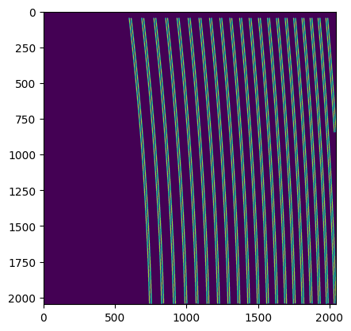

IRD stream
==========

By using the framework of ``Stream2D``, you can apply functions into
multiple fits files. Here, we try to reduce from raw data to wavelength
calibrated spectra.

Start by setting a path for the directory which contains raw data of
‘Flat’, ‘ThAr’, and ‘Target’ (and ‘Dark’, optionally)

.. code:: ipython3

    import pathlib
    basedir = pathlib.Path('~/pyird/data/20210317/').expanduser()

and some common variables.

.. code:: ipython3

    band = 'h' #'h' or 'y'
    mmf = 'mmf2' #'mmf1' (comb fiber) or 'mmf2' (star fiber)
    skipLFC = False #if False, uncertainties are output. mmf1 of y band must be reduced first.

If ``skipLFC`` is False (default), uncertainties and signal-to-noise
ratio at each wavelength are included in output files (*nw?????_m?.dat\*
and \*ncw?????_m?.dat*), computed by using the readout noise (RN) in the
comb spectrum (in mmf1) of the Y/J band. Therefore, spectrum of mmf1 in
the Y/J band should be reduced first when ``skipLFC=False.``

If ``skipLFC=True``, the RN is set by the default value (RN=12
:math:`e^{-}`).

Preprocessing of calibration dataset
------------------------------------

Set the directory and frame numbers for ‘Flat’ to search for reference
apertures for spectrum extraction.

-  It would be better to use FLAT_COMB data (flat light injected to the
   LFC fiber) because lights can be found in both fibers so that there
   is no need to change frame IDs when switching fiber to analyze.
-  Frame numbers can be set the even numbers. When analyzing H band,
   they are increased by one by using ``fitsid_increment()``.

.. code:: ipython3

    from pyird.utils import irdstream
    ## FLAT_COMB
    datadir = basedir/'flat/'
    anadir = basedir/'reduc/'
    flat_comb=irdstream.Stream2D("flat_comb",datadir,anadir)
    flat_comb.fitsid=list(range(41704,41804,2)) 
    
    flat_comb.band=band
    print(flat_comb.band,' band')

.. parsed-literal::

    No fitsid yet.
    h  band

The function ``aptrace`` searches apertures to be traced.

-  The number of apertures is specified by ``nap``, which should be set
   42 (or 21) for H band and 102 (or 51) for YJ band.
-  The apertures begin its search at ``cutrow``, which is the row number
   of the detector (wavelength direction), and continue in the direction
   of increasing numbers until it matches the appropriate number of
   apertures. You may as well change the value of ``cutrow`` if the
   aperture trace is failed.

.. code:: ipython3

    # aperture extraction
    if band=='h' and flat_comb.fitsid[0]%2==0:
        flat_comb.fitsid_increment() 
        trace_mmf=flat_comb.aptrace(cutrow = 1200,nap=42) 
    elif band=='y':
        trace_mmf=flat_comb.aptrace(cutrow = 1000,nap=102) 

.. parsed-literal::

    median combine:  

.. parsed-literal::

    100%|████████████████████████████████████████████████████████████████████████████████████████████████████████████████| 50/50 [00:00<00:00, 509.65it/s]

.. parsed-literal::

    cross-section: row  1201

.. image:: IRD_stream_files/IRD_stream_8_3.png

.. parsed-literal::

    100%|█████████████████████████████████████████████████████████████████████████████████████████████████████████████████| 42/42 [00:12<00:00,  3.48it/s]

.. image:: IRD_stream_files/IRD_stream_8_5.png

You can change the aperture width if you want. By default, the width is
6 pixels (from -2 to +4) for IRD data and 5 pixels (from -2 to 3) for
REACH data.

For example, setting to 6 pixels (from -2 to +4) can be done as follows:

.. code:: ipython3

    width_str, width_end = 2, 4
    trace_mmf.width = [width_str, width_end]

Show trace mask.

.. code:: ipython3

    trace_mask = trace_mmf.mask()
    
    import matplotlib.pyplot as plt
    # apeture mask plot
    plt.imshow(trace_mmf.mask()) 
    plt.show()

.. parsed-literal::

    100%|████████████████████████████████████████████████████████████████████████████████████████████████████████████████| 42/42 [00:00<00:00, 101.46it/s]
    100%|████████████████████████████████████████████████████████████████████████████████████████████████████████████████| 42/42 [00:00<00:00, 103.25it/s]

There are two options for the hotpixel mask:

One is made from dark data as follows.

.. code:: ipython3

    from pyird.image.bias import bias_subtract_image
    from pyird.image.hotpix import identify_hotpix_sigclip
    
    ## HOTPIXEL MASK: 
    ## DARK
    datadir = basedir/'dark/'
    anadir = basedir/'reduc/'
    dark = irdstream.Stream2D('dark', datadir, anadir,fitsid=[43814]) # Multiple file is ok
    if band=='h' and dark.fitsid[0]%2==0:
        dark.fitsid_increment() 
    median_image = dark.immedian()
    im_subbias = bias_subtract_image(median_image)
    hotpix_mask = identify_hotpix_sigclip(im_subbias)

.. parsed-literal::

    fitsid: [43814]
    median combine:  

.. parsed-literal::

    100%|██████████████████████████████████████████████████████████████████████████████████████████████████████████████████| 1/1 [00:00<00:00, 110.40it/s]

.. parsed-literal::

    hotpix mask = 0.45 percent

Another option is reading the prepared hotpixel mask as follows.

.. code:: ipython3

    # example to read a hotpixel mask used in IRD
    import pkg_resources
    from pyird.io.read_hotpix import read_hotpix
    if band=='h':
        path=pkg_resources.resource_filename('pyird', 'data/hotpix_mask_h_202210_180s.fits')
    elif band=='y':
        path=pkg_resources.resource_filename('pyird', 'data/hotpix_mask_y_202210_180s.fits')
    hotpix_mask=read_hotpix(path)

Then, select the fiber to analyze. The following operations are just
drop even/odd number of apertures from all apertures identified by Flat.

.. code:: ipython3

    # reduce mmf1 or mmf2
    if mmf=='mmf2':
        trace_mmf.mmf2() #mmf2 (star fiber)
    elif mmf=='mmf1':
        trace_mmf.mmf1() #mmf1 (comb fiber)

Wavelength calibration is performed by using reference frames
(Thrium-Argon). We do not need to identify the emission lines by eye;
``calibrate_wavelength`` automatically refer to the line list!

.. code:: ipython3

    ## THAR (ThAr-ThAr)
    datadir = basedir/'thar'
    anadir = basedir/'reduc'
    if band=='h':
        rawtag='IRDAD000'
    elif band=='y':
        rawtag='IRDBD000'
    #wavelength calibration
    thar=irdstream.Stream2D("thar",datadir,anadir,rawtag=rawtag,fitsid=list(range(14632,14732)))
    thar.trace = trace_mmf
    thar.clean_pattern(trace_mask=trace_mask,extin='', extout='_cp', hotpix_mask=hotpix_mask)
    thar.calibrate_wavelength()

.. parsed-literal::

    fitsid: [14632, 14633, 14634, 14635, 14636, 14637, 14638, 14639, 14640, 14641, 14642, 14643, 14644, 14645, 14646, 14647, 14648, 14649, 14650, 14651, 14652, 14653, 14654, 14655, 14656, 14657, 14658, 14659, 14660, 14661, 14662, 14663, 14664, 14665, 14666, 14667, 14668, 14669, 14670, 14671, 14672, 14673, 14674, 14675, 14676, 14677, 14678, 14679, 14680, 14681, 14682, 14683, 14684, 14685, 14686, 14687, 14688, 14689, 14690, 14691, 14692, 14693, 14694, 14695, 14696, 14697, 14698, 14699, 14700, 14701, 14702, 14703, 14704, 14705, 14706, 14707, 14708, 14709, 14710, 14711, 14712, 14713, 14714, 14715, 14716, 14717, 14718, 14719, 14720, 14721, 14722, 14723, 14724, 14725, 14726, 14727, 14728, 14729, 14730, 14731]
    Skipped 100 files because they already exists.

.. parsed-literal::

    0it [00:00, ?it/s]

.. parsed-literal::

    median combine:  _cp

.. parsed-literal::

    100%|█████████████████████████████████████████████████████████████████████████████████████████████████████████████| 100/100 [00:00<00:00, 1310.82it/s]
    /Users/yuikasagi/miniforge3/envs/py39_pip/lib/python3.9/site-packages/numpy/lib/nanfunctions.py:1218: RuntimeWarning: All-NaN slice encountered
      r, k = function_base._ureduce(a, func=_nanmedian, axis=axis, out=out,

To reduce the fringe appearing in a spectrum, a process like
[\`\ ``hdsis_ecf''](https://github.com/chimari/hds_iraf) for HDS/Subaru data is applied. In the preparation of this process, we create the normalized flat by using``\ apnormalize.\`

.. code:: ipython3

    ## FLAT
    if mmf=='mmf2':
        ## FLAT_STAR
        datadir = basedir/'flat/'
        anadir = basedir/'reduc/'
        flat_star=irdstream.Stream2D("flat_star",datadir,anadir)
        flat_star.fitsid=list(range(41804,41904,2)) 
        flat_star.trace = trace_mmf
        flat_star.band=band 
        if band == 'h' and flat_star.fitsid[0]%2==0:
            flat_star.fitsid_increment() 
        flat_star.clean_pattern(trace_mask=trace_mask,extin='', extout='_cp', hotpix_mask=hotpix_mask)
        flat_star.imcomb = True # median combine
        flat_star.flatten(hotpix_mask=hotpix_mask)
        df_flatn = flat_star.apnormalize()
    elif mmf=='mmf1':
        flat_comb.trace = trace_mmf
        flat_comb.clean_pattern(trace_mask=trace_mask,extin='', extout='_cp', hotpix_mask=hotpix_mask)
        flat_comb.imcomb = True # median combine
        flat_comb.flatten(hotpix_mask=hotpix_mask)
        df_flatn = flat_comb.apnormalize()

.. parsed-literal::

    No fitsid yet.
    Skipped 50 files because they already exists.

.. parsed-literal::

    0it [00:00, ?it/s]

.. parsed-literal::

    continuum is fitted with order_fit = 23.
    median combine:  _cp

.. parsed-literal::

    100%|████████████████████████████████████████████████████████████████████████████████████████████████████████████████| 50/50 [00:00<00:00, 408.17it/s]
    /Users/yuikasagi/miniforge3/envs/py39_pip/lib/python3.9/site-packages/numpy/lib/nanfunctions.py:1218: RuntimeWarning: All-NaN slice encountered
      r, k = function_base._ureduce(a, func=_nanmedian, axis=axis, out=out,
    100%|█████████████████████████████████████████████████████████████████████████████████████████████████████████████████| 21/21 [00:05<00:00,  3.53it/s]

The preparation of calibration data is now complete!

Extract target 1D spectrum
--------------------------

From here, we will extract target spectrum.

.. code:: ipython3

    #--------FOR TARGET--------#
    datadir = basedir/'target/'
    anadir = basedir/'reduc/'
    target = irdstream.Stream2D(
        'targets', datadir, anadir, fitsid=[41510])
    if band=='h' and target.fitsid[0]%2==0:
        target.fitsid_increment() # when you use H-band
    target.info = True  # show detailed info
    target.trace = trace_mmf

.. parsed-literal::

    fitsid: [41510]

Remove noise pattern on detector by ``clean_pattern``.

.. code:: ipython3

    # clean pattern
    target.clean_pattern(trace_mask=trace_mask,extin='', extout='_cp', hotpix_mask=hotpix_mask)

.. parsed-literal::

    clean_pattern: output extension= _cp
    Ignore  IRDA00041511.fits -> IRDA00041511_cp.fits

.. parsed-literal::

    0it [00:00, ?it/s]

In ``apext_flatfield``, each order will be extracted with the flat
fielding. The option of ``hotpix_mask`` determines whether hotpixels are
masked or not.

.. code:: ipython3

    # flatten
    target.apext_flatfield(df_flatn,hotpix_mask=hotpix_mask)

.. parsed-literal::

    Ignore  IRDA00041511_cp.fits -> IRDA00041511_flnhp_m2.fits

.. parsed-literal::

    0it [00:00, ?it/s]

If there is set any hotpixel mask, \*IRDA000?????_flnhp.fits\* will be
created in ``anadir``.

Or, if ``hotpix_mask=None`` (default), \*IRDA000?????_fln.fits\* will be
created in ``anadir``.

Assign wavelength to extracted spectrum.

The option ``extin`` determines whether using the hotpixel masked and
flat fielded spectrum (``extin='_flnhp'``) or not (``extin='fln'``
(default)).

.. code:: ipython3

    # assign reference spectra & resample
    target.dispcor(master_path=thar.anadir,extin='_flnhp')

.. parsed-literal::

    dispcor: output spectrum= w41511_m2.dat

.. image:: IRD_stream_files/IRD_stream_31_1.png

\*w?????_m?.dat\* will be created, whose data format is
``$1: Wavelength [nm]``, ``$2: Order``, ``$3: Counts``.

\*w?????_m?.dat\* reflects the blaze function, so we want to “normalize”
the spectra.

The blaze function of each order are created by applying the same
aperture extract procedure to Flat image.

.. code:: ipython3

    # blaze function
    if mmf=='mmf2':
        flat_star.apext_flatfield(df_flatn,hotpix_mask=hotpix_mask)
        flat_star.dispcor(master_path=thar.anadir)
    elif mmf=='mmf1':
        flat_comb.apext_flatfield(df_flatn,hotpix_mask=hotpix_mask)
        flat_comb.dispcor(master_path=thar.anadir)

.. image:: IRD_stream_files/IRD_stream_34_0.png

Flat spectrum is now extracted, and *wflat_h_m?.dat* is created.

Then, fit the continuum of the flat spectrum as blaze function and
devide target spectrum by them.

.. code:: ipython3

    # combine & normalize
    if mmf=='mmf2':
        target.normalize1D(master_path=flat_star.anadir,skipLFC=skipLFC)
    elif mmf=='mmf1':
        target.normalize1D(master_path=flat_comb.anadir,skipLFC=skipLFC)

.. parsed-literal::

    Readout Noise is : 7.9305032251889385

.. parsed-literal::

    /Users/yuikasagi/miniforge3/envs/py39_pip/lib/python3.9/site-packages/pandas/core/arraylike.py:397: RuntimeWarning: invalid value encountered in sqrt
      result = getattr(ufunc, method)(*inputs, **kwargs)
    /Users/yuikasagi/miniforge3/envs/py39_pip/lib/python3.9/site-packages/pandas/core/arraylike.py:397: RuntimeWarning: invalid value encountered in sqrt
      result = getattr(ufunc, method)(*inputs, **kwargs)

.. parsed-literal::

    normalize1D: output normalized 1D spectrum= nw41511_m2.dat

.. image:: IRD_stream_files/IRD_stream_36_3.png

.. image:: IRD_stream_files/IRD_stream_36_4.png

After ``normalize1D``, normalized spectrum (*nw?????_m?.dat*) will be
created.

The data format is ``$1: Wavelength [nm]``, ``$2: Order``,
``$3: Counts``, ``$4: S/N``, ``$5: Uncertainties``.

In addition, there will be \*ncw?????_m?.dat*, which is the order
combined spectrum.

There are overlapping wavelengths at the edge of order, so we
“normalize” the spectrum after summing up the flux of that regions to
higher signal-to-noise ratio.

The data format is ``$1: Wavelength [nm]``, ``$2: Counts``, ``$3: S/N``,
``$4: Uncertainties``.
