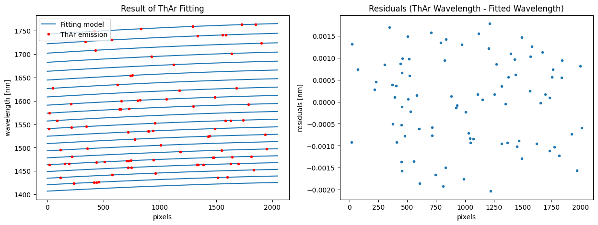

Pipeline to Get 1D Spectra from Raw Data (IRD Stream)
=====================================================

This tutorial demonstrates how to reduce raw data to
wavelength-calibrated 1D spectra. By using the ``Stream2D`` framework,
you can apply functions to multiple FITS files efficiently.

- :ref:`step0`
- :ref:`step1`
    - :ref:`step1-1`
    - :ref:`step1-2` 
    - :ref:`step1-3`
    - :ref:`step1-4`
- :ref:`step2`
    - :ref:`step2-1`
    - :ref:`step2-2`
    - :ref:`step2-3`
    - :ref:`step2-4`
    - :ref:`step2-5`

.. _step0:

Step 0: Settings
----------------

Directory Structure
~~~~~~~~~~~~~~~~~~~

First, create a ``datadir`` for the raw data and ``anadir`` for storing
the output.

This tutorial assumes the following directory structure:

::

   .
   └── pyird/
       └── data/
           └── 20210317/
               ├── flat
               ├── thar
               ├── target
               ├── dark
               └── reduc

In this structure, the flat, thar, target, and dark directories are part
of the ``datadir``, each containing raw data for ‘Flat’, ‘ThAr’,
‘Target’, and optionally ‘Dark’ frames. The reduc directory is used as
``anadir`` for storing processed data.

.. code:: ipython3

    import pathlib
    basedir = pathlib.Path('~/pyird/data/20210317/').expanduser()
    
    datadir_flat = basedir/'flat/'
    datadir_dark = basedir/'dark/'
    datadir_thar = basedir/'thar'
    datadir_target = basedir/'target/'
    anadir = basedir/'reduc/'

Specify the Data to be Analyzed
~~~~~~~~~~~~~~~~~~~~~~~~~~~~~~~

Please change the following variables based on the data you want to
analyze.

.. code:: ipython3

    band = 'h' #'h' or 'y'
    mmf = 'mmf2' #'mmf1' (comb fiber) or 'mmf2' (star fiber)
    readout_noise_mode = 'default'
    
    # file numbers of fits files (last five digits)
    fitsid_flat_comb = list(range(41704,41804,2)) 
    fitsid_flat_star = list(range(41804,41904,2)) 
    fitsid_dark = [41504]
    fitsid_thar = list(range(14632,14732))
    fitsid_target = [41510]

**Note**:

Ensure that the ``readout_noise_mode`` is set to either ‘real’ or
‘default’.

-  ``readout_noise_mode = 'real'``: Need to reduce the dataset with
   ``band = 'y'`` and ``mmf = 'mmf1'`` at first.

   -  With this setting, uncertainties and signal-to-noise ratio at each
      wavelength will be included in the output files (**nw…_m?.dat*\*
      and \**ncw…_m?.dat**).
   -  Those values are based on the readout noise (RN) calculated using
      the comb spectrum (in mmf1) of the Y/J band.

-  ``readout_noise_mode = 'default'``: Uses a default readout noise (RN)
   value (RN=12 :math:`e^{-}`).

.. _step1:

Step 1: Preprocessing the Calibration Dataset
---------------------------------------------

.. _step1-1:

Step 1-1: Identifying Apertures
~~~~~~~~~~~~~~~~~~~~~~~~~~~~~~~

-  The ``aptrace`` function is used to identify apertures.
-  Number of apertures (``nap``): 42 for H band, 102 for Y/J band.
-  These apertures are identified in the FLAT_COMB data.
-  If your observation was performed with a single fiber, set ``nap`` to
   half the default value.

.. code:: ipython3

    from pyird.utils import irdstream
    
    ## FLAT_COMB
    # settings
    flat_comb = irdstream.Stream2D("flat_comb",datadir_flat,anadir)
    flat_comb.fitsid = fitsid_flat_comb
    
    flat_comb.band = band
    
    # aperture extraction
    if band=='h' and flat_comb.fitsid[0]%2==0:
        flat_comb.fitsid_increment() 
        trace_mmf=flat_comb.aptrace(cutrow = 1200,nap=42) 
    elif band=='y':
        trace_mmf=flat_comb.aptrace(cutrow = 1000,nap=102) 

.. parsed-literal::

    No fitsid yet.
    median combine:  

.. parsed-literal::

    100%|████████████████████████████████████████████████████████████████████████████████████████████████████████████████| 50/50 [00:00<00:00, 660.82it/s]

.. parsed-literal::

    default nap value
    cross-section: row  1201

.. parsed-literal::

    100%|█████████████████████████████████████████████████████████████████████████████████████████████████████████████████| 42/42 [00:08<00:00,  4.74it/s]

-  Define ‘trace_mask’ to mask light from both fibers.
-  Aperture width is 6 pixels (from -2 to +4) for IRD data and 5 pixels
   (from -2 to 3) for REACH data by default. You can change it
   ``.width`` instance of trace_mmf.

.. code:: ipython3

    trace_mask = trace_mmf.mask()

.. parsed-literal::

    100%|█████████████████████████████████████████████████████████████████████████████████████████████████████████████████| 42/42 [00:00<00:00, 92.66it/s]

-  Reduce apertures in the mask to extract the spectrum from the desired
   fiber

.. code:: ipython3

    if mmf=='mmf2':
        trace_mmf.choose_mmf2_aperture() #mmf2 (star fiber)
    elif mmf=='mmf1':
        trace_mmf.choose_mmf1_aperture() #mmf1 (comb fiber)

.. _step1-2:

Step 1-2: Removing hotpixels
~~~~~~~~~~~~~~~~~~~~~~~~~~~~

-  There are two options for creating the hotpixel mask.
-  This tutorial introduces one method using dark data.
-  Refer to
   `pyird.io.read_hotpix <https://secondearths.sakura.ne.jp/pyird/pyird/pyird.io.html#module-pyird.io.read_hotpix>`_
   module for an alternative approach without dark data.

.. code:: ipython3

    from pyird.image.bias import bias_subtract_image
    from pyird.image.hotpix import identify_hotpix_sigclip
    
    ## HOTPIXEL MASK: 
    ## DARK
    dark = irdstream.Stream2D('dark', datadir_dark, anadir,fitsid=fitsid_dark) # Multiple file is ok
    if band=='h' and dark.fitsid[0]%2==0:
        dark.fitsid_increment() 
    median_image = dark.immedian()
    im_subbias = bias_subtract_image(median_image)
    hotpix_mask = identify_hotpix_sigclip(im_subbias)

.. parsed-literal::

    fitsid: [41504]
    median combine:  

.. parsed-literal::

    100%|███████████████████████████████████████████████████████████████████████████████████████████████████████████████████| 1/1 [00:00<00:00, 88.39it/s]

.. parsed-literal::

    hotpix mask = 0.58 percent

.. _step1-3:

Step 1-3: Wavelength Calibration
~~~~~~~~~~~~~~~~~~~~~~~~~~~~~~~~

-  Wavelength calibration is performed by using reference frames
   (Thrium-Argon).
-  You do not need to manually identify emission lines;
   ``calibrate_wavelength`` automatically references the line list!

.. code:: ipython3

    ## THAR (ThAr-ThAr)
    # Settings
    if band=='h':
        rawtag='IRDAD000'
    elif band=='y':
        rawtag='IRDBD000'
    thar=irdstream.Stream2D("thar",datadir_thar,anadir,rawtag=rawtag,fitsid=fitsid_thar)
    thar.trace = trace_mmf
    
    # removing noise pattern
    thar.clean_pattern(trace_mask=trace_mask,extin='', extout='_cp', hotpix_mask=hotpix_mask)
    
    # wavelength calibration
    thar.calibrate_wavelength()

.. parsed-literal::

    fitsid: [14632, 14633, 14634, 14635, 14636, 14637, 14638, 14639, 14640, 14641, 14642, 14643, 14644, 14645, 14646, 14647, 14648, 14649, 14650, 14651, 14652, 14653, 14654, 14655, 14656, 14657, 14658, 14659, 14660, 14661, 14662, 14663, 14664, 14665, 14666, 14667, 14668, 14669, 14670, 14671, 14672, 14673, 14674, 14675, 14676, 14677, 14678, 14679, 14680, 14681, 14682, 14683, 14684, 14685, 14686, 14687, 14688, 14689, 14690, 14691, 14692, 14693, 14694, 14695, 14696, 14697, 14698, 14699, 14700, 14701, 14702, 14703, 14704, 14705, 14706, 14707, 14708, 14709, 14710, 14711, 14712, 14713, 14714, 14715, 14716, 14717, 14718, 14719, 14720, 14721, 14722, 14723, 14724, 14725, 14726, 14727, 14728, 14729, 14730, 14731]
    clean_pattern: output extension=_cp

.. parsed-literal::

    100%|███████████████████████████████████████████████████████████████████████████████████████████████████████████████| 100/100 [01:53<00:00,  1.13s/it]

.. parsed-literal::

    median combine:  _cp

.. parsed-literal::

    100%|█████████████████████████████████████████████████████████████████████████████████████████████████████████████| 100/100 [00:00<00:00, 1516.48it/s]
    100%|█████████████████████████████████████████████████████████████████████████████████████████████████████████████████| 21/21 [00:00<00:00, 66.86it/s]

.. parsed-literal::

    H band
    standard deviation of residuals (1st identification) = 0.00903
    Start iterations of ThAr fitting:
    # 1 standard dev= 0.013415005792103694
    # 2 standard dev= 0.007880495994009905
    # 3 standard dev= 0.004202464874535437
    # 4 standard dev= 0.002822477265367421
    # 5 standard dev= 0.002028846900495061
    # 6 standard dev= 0.0015434335508579676
    # 7 standard dev= 0.0012824666454781142
    # 8 standard dev= 0.0010031919744074736
    # 9 standard dev= 0.0007795137870712668

.. _step1-4:

Step 1-4: Creating a Normalized Flat
~~~~~~~~~~~~~~~~~~~~~~~~~~~~~~~~~~~~

-  This process similar to
   `hdsis_ecf <https://github.com/chimari/hds_iraf>`_ for
   HDS/Subaru data to reduce the fringe appearing in a spectrum.
-  In the preparation of this process, we create the normalized flat by
   using ``apnormalize``.
-  After applying ``flatten``, **‘{stream_id}_{band}_{mmf}.fits’**
   (e.g., flat_star_h_m2.fits) is created in anadir, containing the
   extracted spectrum of flat data.

.. code:: ipython3

    ## FLAT
    if mmf=='mmf2': # Star fiber -> FLAT_STAR
        # Settings
        flat_star=irdstream.Stream2D("flat_star",datadir_flat,anadir)
        flat_star.fitsid=fitsid_flat_star
        flat_star.trace = trace_mmf
        flat_star.band=band 
        if band == 'h' and flat_star.fitsid[0]%2==0:
            flat_star.fitsid_increment() 
    
        # Removing noise pattern
        flat_star.clean_pattern(trace_mask=trace_mask,extin='', extout='_cp', hotpix_mask=hotpix_mask)
        flat_star.imcomb = True # median combine
    
        # Extract 1D spectrum
        flat_star.flatten(hotpix_mask=hotpix_mask)
    
        # Flat spectrum normalized in each pixel within an aperture
        df_flatn = flat_star.apnormalize()
    
    elif mmf=='mmf1': # Comb fiber -> FLAT_COMB
        flat_comb.trace = trace_mmf
    
        # Removing noise pattern
        flat_comb.clean_pattern(trace_mask=trace_mask,extin='', extout='_cp', hotpix_mask=hotpix_mask)
        flat_comb.imcomb = True # median combine
    
        # Extract 1D spectrum
        flat_comb.flatten(hotpix_mask=hotpix_mask)
    
        # Flat spectrum normalized in each pixel within an aperture
        df_flatn = flat_comb.apnormalize()

.. parsed-literal::

    No fitsid yet.
    clean_pattern: output extension=_cp

.. parsed-literal::

    100%|█████████████████████████████████████████████████████████████████████████████████████████████████████████████████| 50/50 [00:53<00:00,  1.07s/it]
      0%|                                                                                                                           | 0/1 [00:00<?, ?it/s]

.. parsed-literal::

    median combine:  _cp

.. parsed-literal::

    
    100%|████████████████████████████████████████████████████████████████████████████████████████████████████████████████| 50/50 [00:00<00:00, 654.18it/s]
    
      0%|                                                                                                                          | 0/21 [00:00<?, ?it/s]
     38%|███████████████████████████████████████████▝                                                                      | 8/21 [00:00<00:00, 70.63it/s]
    100%|█████████████████████████████████████████████████████████████████████████████████████████████████████████████████| 21/21 [00:00<00:00, 66.97it/s]
    
      0%|                                                                                                                          | 0/21 [00:00<?, ?it/s]
     38%|███████████████████████████████████████████▝                                                                      | 8/21 [00:00<00:00, 71.10it/s]
    100%|█████████████████████████████████████████████████████████████████████████████████████████████████████████████████| 21/21 [00:00<00:00, 67.10it/s]
    100%|███████████████████████████████████████████████████████████████████████████████████████████████████████████████████| 1/1 [00:18<00:00, 18.19s/it]

.. parsed-literal::

    flatten (+ hotpix mask): output extension=_hp_m2
    continuum is fitted with order_fit = 23.
    median combine:  _cp

.. parsed-literal::

    100%|████████████████████████████████████████████████████████████████████████████████████████████████████████████████| 50/50 [00:00<00:00, 710.76it/s]
    100%|█████████████████████████████████████████████████████████████████████████████████████████████████████████████████| 21/21 [00:05<00:00,  4.14it/s]

.. _step2:

Step 2: Extracting the Target 1D Spectrum
-----------------------------------------

From here, we will extract target spectrum.

.. code:: ipython3

    #--------FOR TARGET--------#
    # Settings
    target = irdstream.Stream2D('targets', datadir_target, anadir, fitsid=fitsid_target)
    if band=='h' and target.fitsid[0]%2==0:
        target.fitsid_increment() # when you use H-band
    target.info = True  # show detailed info
    target.trace = trace_mmf

.. parsed-literal::

    fitsid: [41510]

.. _step2-1:

Step 2-1: Removing Noise Pattern on the Detector
~~~~~~~~~~~~~~~~~~~~~~~~~~~~~~~~~~~~~~~~~~~~~~~~

.. code:: ipython3

    target.clean_pattern(trace_mask=trace_mask, extin='', extout='_cp', hotpix_mask=hotpix_mask)

.. parsed-literal::

    clean_pattern: output extension=_cp

.. parsed-literal::

    100%|███████████████████████████████████████████████████████████████████████████████████████████████████████████████████| 1/1 [00:00<00:00,  1.13it/s]

.. _step2-2:

Step 2-2: Aperture Extraction & Flat Fielding
~~~~~~~~~~~~~~~~~~~~~~~~~~~~~~~~~~~~~~~~~~~~~

-  The ``apext_flatfield`` function extracts each order while applying
   flat fielding.
-  This process requires the flat spectrum normalized in each pixel
   within an aperture (i.e., df_flatn).
-  After this process, \**’IRDA000…_flnhp.fits’*\* (when ``hotpix_mask``
   is set) or \**’IRDA000…_fln.fits’*\* (when ``hotpix_mask = None``) is
   created.

.. code:: ipython3

    target.apext_flatfield(df_flatn, hotpix_mask=hotpix_mask)

.. parsed-literal::

      0%|                                                                                                                           | 0/1 [00:00<?, ?it/s]
      0%|                                                                                                                          | 0/21 [00:00<?, ?it/s]
      5%|█████▝                                                                                                            | 1/21 [00:00<00:02,  9.62it/s]
     10%|██████████▊                                                                                                       | 2/21 [00:00<00:03,  5.24it/s]
     14%|████████████████▎                                                                                                 | 3/21 [00:00<00:03,  4.58it/s]
     19%|█████████████████████▋                                                                                            | 4/21 [00:00<00:03,  4.33it/s]
     24%|███████████████████████████▝                                                                                      | 5/21 [00:01<00:03,  4.19it/s]
     29%|████████████████████████████████▌                                                                                 | 6/21 [00:01<00:03,  4.11it/s]
     33%|██████████████████████████████████████                                                                            | 7/21 [00:01<00:03,  4.08it/s]
     38%|███████████████████████████████████████████▝                                                                      | 8/21 [00:01<00:03,  4.05it/s]
     43%|████████████████████████████████████████████████▊                                                                 | 9/21 [00:02<00:02,  4.04it/s]
     48%|█████████████████████████████████████████████████████▊                                                           | 10/21 [00:02<00:02,  4.03it/s]
     52%|███████████████████████████████████████████████████████████▝                                                     | 11/21 [00:02<00:02,  4.03it/s]
     57%|████████████████████████████████████████████████████████████████▌                                                | 12/21 [00:02<00:02,  4.02it/s]
     62%|█████████████████████████████████████████████████████████████████████▉                                           | 13/21 [00:03<00:01,  4.01it/s]
     67%|███████████████████████████████████████████████████████████████████████████▎                                     | 14/21 [00:03<00:01,  4.01it/s]
     71%|████████████████████████████████████████████████████████████████████████████████▋                                | 15/21 [00:03<00:01,  4.01it/s]
     76%|██████████████████████████████████████████████████████████████████████████████████████                           | 16/21 [00:03<00:01,  4.01it/s]
     81%|███████████████████████████████████████████████████████████████████████████████████████████▝                     | 17/21 [00:04<00:01,  4.00it/s]
     86%|████████████████████████████████████████████████████████████████████████████████████████████████▊                | 18/21 [00:04<00:00,  4.00it/s]
     90%|██████████████████████████████████████████████████████████████████████████████████████████████████████▝          | 19/21 [00:04<00:00,  4.00it/s]
     95%|███████████████████████████████████████████████████████████████████████████████████████████████████████████▌     | 20/21 [00:04<00:00,  4.00it/s]
    100%|█████████████████████████████████████████████████████████████████████████████████████████████████████████████████| 21/21 [00:05<00:00,  4.11it/s]
    100%|███████████████████████████████████████████████████████████████████████████████████████████████████████████████████| 1/1 [00:05<00:00,  5.21s/it]

.. parsed-literal::

    pixel = -2, Mean = 0.84719
    pixel = -1, Mean = 1.35781
    pixel = 0, Mean = 1.46712
    pixel = 1, Mean = 1.34045
    pixel = 2, Mean = 0.77174
    pixel = 3, Mean = 0.17889

.. parsed-literal::

    

.. _step2-3:

Step 2-3: Assigning Wavelength to the Extracted Spectrum
~~~~~~~~~~~~~~~~~~~~~~~~~~~~~~~~~~~~~~~~~~~~~~~~~~~~~~~~

-  The ``dispcor`` function assigns wavelength solution to the extracted
   spectrum.
-  Please change the ``extin`` option to ``extin='_flnhp'`` or
   ``extin='_fln'`` depending on the previous process.
-  After this process, \**’w…_m?.dat’*\* is created, with data format:
   ``$1: Wavelength [nm]``, ``$2: Order``, ``$3: Counts``.

.. code:: ipython3

    target.dispcor(master_path=thar.anadir,extin='_flnhp')

.. parsed-literal::

    dispcor: output spectrum= w41511_m2.dat

.. _step2-4:

Step 2-4: Creating the Blaze Function
~~~~~~~~~~~~~~~~~~~~~~~~~~~~~~~~~~~~~

-  The blaze function is created from FLAT spectrum to ‘’normalize’’ the
   spectra.
-  After this process, \**’wblaze_{band}_{mmf}.dat’*\* is created.

.. code:: ipython3

    # blaze function
    if mmf=='mmf2':
        flat_star.apext_flatfield(df_flatn,hotpix_mask=hotpix_mask)
        flat_star.dispcor(master_path=thar.anadir)
    elif mmf=='mmf1':
        flat_comb.apext_flatfield(df_flatn,hotpix_mask=hotpix_mask)
        flat_comb.dispcor(master_path=thar.anadir)

.. parsed-literal::

      0%|                                                                                                                           | 0/1 [00:00<?, ?it/s]

.. parsed-literal::

    median combine:  _cp

.. parsed-literal::

    
    100%|████████████████████████████████████████████████████████████████████████████████████████████████████████████████| 50/50 [00:00<00:00, 608.52it/s]
    
      0%|                                                                                                                          | 0/21 [00:00<?, ?it/s]
      5%|█████▝                                                                                                            | 1/21 [00:00<00:02,  9.99it/s]
     10%|██████████▊                                                                                                       | 2/21 [00:00<00:03,  5.33it/s]
     14%|████████████████▎                                                                                                 | 3/21 [00:00<00:03,  4.63it/s]
     19%|█████████████████████▋                                                                                            | 4/21 [00:00<00:03,  4.36it/s]
     24%|███████████████████████████▝                                                                                      | 5/21 [00:01<00:03,  4.23it/s]
     29%|████████████████████████████████▌                                                                                 | 6/21 [00:01<00:03,  4.16it/s]
     33%|██████████████████████████████████████                                                                            | 7/21 [00:01<00:03,  4.11it/s]
     38%|███████████████████████████████████████████▝                                                                      | 8/21 [00:01<00:03,  4.07it/s]
     43%|████████████████████████████████████████████████▊                                                                 | 9/21 [00:02<00:02,  4.04it/s]
     48%|█████████████████████████████████████████████████████▊                                                           | 10/21 [00:02<00:02,  3.97it/s]
     52%|███████████████████████████████████████████████████████████▝                                                     | 11/21 [00:02<00:02,  3.91it/s]
     57%|████████████████████████████████████████████████████████████████▌                                                | 12/21 [00:02<00:02,  3.90it/s]
     62%|█████████████████████████████████████████████████████████████████████▉                                           | 13/21 [00:03<00:02,  3.91it/s]
     67%|███████████████████████████████████████████████████████████████████████████▎                                     | 14/21 [00:03<00:01,  3.92it/s]
     71%|████████████████████████████████████████████████████████████████████████████████▋                                | 15/21 [00:03<00:01,  3.93it/s]
     76%|██████████████████████████████████████████████████████████████████████████████████████                           | 16/21 [00:03<00:01,  3.95it/s]
     81%|███████████████████████████████████████████████████████████████████████████████████████████▝                     | 17/21 [00:04<00:01,  3.96it/s]
     86%|████████████████████████████████████████████████████████████████████████████████████████████████▊                | 18/21 [00:04<00:00,  3.98it/s]
     90%|██████████████████████████████████████████████████████████████████████████████████████████████████████▝          | 19/21 [00:04<00:00,  3.99it/s]
     95%|███████████████████████████████████████████████████████████████████████████████████████████████████████████▌     | 20/21 [00:04<00:00,  4.00it/s]
    100%|█████████████████████████████████████████████████████████████████████████████████████████████████████████████████| 21/21 [00:05<00:00,  4.09it/s]
    100%|███████████████████████████████████████████████████████████████████████████████████████████████████████████████████| 1/1 [00:23<00:00, 23.57s/it]

.. parsed-literal::

    pixel = -2, Mean = 0.84719
    pixel = -1, Mean = 1.35781
    pixel = 0, Mean = 1.46712
    pixel = 1, Mean = 1.34045
    pixel = 2, Mean = 0.77174
    pixel = 3, Mean = 0.17889
    dispcor: output spectrum= wblaze_h_m2.dat

.. _step2-5:

Step 2-5: Normalizing the Spectra
~~~~~~~~~~~~~~~~~~~~~~~~~~~~~~~~~

-  Normalize the target spectrum by dividing it by the blaze function.
-  After ``normalize1D``, the normalized spectrum (**nw…_m?.dat\ **) and
   the order-combined spectrum (**\ ncw…_m?.dat**) are created.

   -  Data formats are:

      -  Normalized (**nw**): ``$1: Wavelength [nm]``, ``$2: Order``,
         ``$3: Counts``, ``$4: S/N``, ``$5: Uncertainties``
      -  Order-combined (**ncw**): ``$1: Wavelength [nm]``,
         ``$2: Counts``, ``$3: S/N``, ``$4: Uncertainties``

-  For the order-combined spectra: There are overlapping wavelengths at
   the edges of orders, so we “normalize” by summing up the flux in
   these regions to improve the signal-to-noise ratio.

.. code:: ipython3

    # combine & normalize
    if mmf=='mmf2':
        target.normalize1D(master_path=flat_star.anadir,readout_noise_mode=readout_noise_mode)
    elif mmf=='mmf1':
        target.normalize1D(master_path=flat_comb.anadir,readout_noise_mode=readout_noise_mode)

.. parsed-literal::

    Using default readout Noise : 12
    readout noise of IRD detectors: ~12e- (10min exposure)
    normalize1D: output normalized 1D spectrum= nw41511_m2.dat

.. image:: IRD_stream_files/IRD_stream_34_2.png

This concludes the data reduction process!
