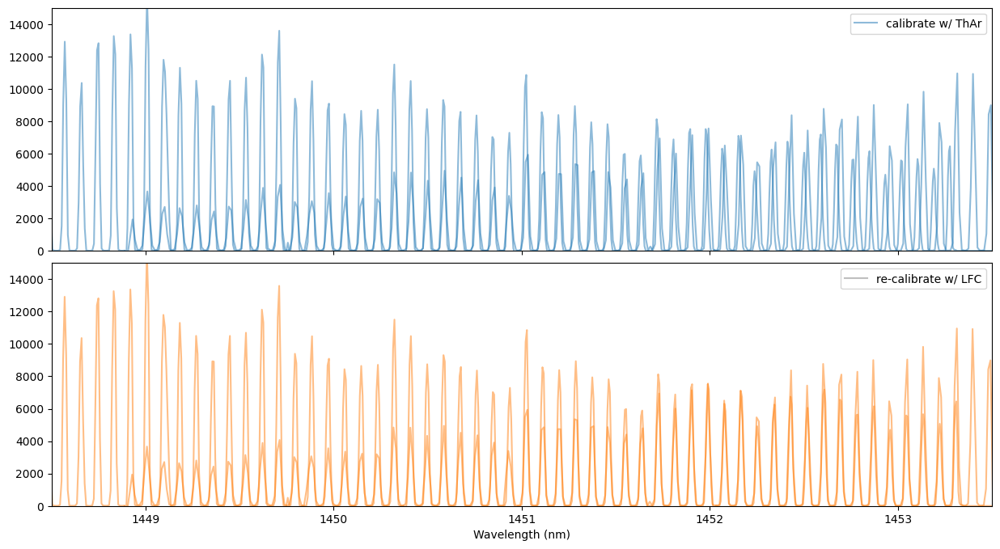
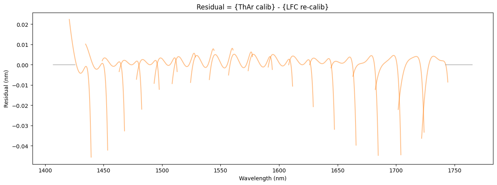

Wavelength Re-calibration with LFC
==================================

This tutorial demonstrates how to perform wavelength recalibration using
a laser frequency comb (LFC).

The initial wavelength solution, which is roughly determined using ThAr
lines, is refined using the LFC.
The LFC provides a set of lines that are evenly spaced in frequency
space, enabling highly precise recalibration.

This methodology was originally developed by T. Hirano
(`Hirano et al. 2020 <https://ui.adsabs.harvard.edu/abs/2020PASJ...72...93H/abstract>`_).

- :ref:`step0`
- :ref:`step1`
- :ref:`step2`

.. _step0:

Step 0: Preparation
-------------------

Required data: 
  1. Target spectra with an initial wavelength solution(created by IRD_stream.py) 
  2. LFC spectra with wavelength information, generated using the same procedure as the target spectra (as followings)

LFC dataset (comb_data.tar.gz) can be downloaded from the `Zenodo repository <https://doi.org/10.5281/zenodo.14614003>`_

.. code:: ipython3

    # Add the following code at the end of IRD_stream.py to generate the LFC spectra:

    datadir_comb = basedir/'comb/'
    comb_id = [14733, 14832]
    
    comb_master = irdstream.Stream2D("comb_master",
                                datadir_comb,
                                anadir,
                                fitsid=list(range(comb_id[0], comb_id[-1]+1)),
                                rawtag=rawtag,
                                band=band)
    comb_master.trace = trace_mmf
    comb_master.clean_pattern(trace_mask=trace_mask,
                         extin='', 
                         extout='_cp', 
                         hotpix_mask=hotpix_mask)
    comb_master.imcomb = True
    comb_master.apext_flatfield(df_flatn, hotpix_mask=hotpix_mask)
    comb_master.dispcor(master_path=thar.anadir, blaze=False)

After running the script, confirm that a new file (e.g.,
``wcomb_master_h_m2.dat``) has been created in the specified analysis
directory.

In this tutorial, we use data obtained with IRD where LFC light is
injected into both fibers. Alternatively, users may use
``COMB_STAR`` or ``COMB_COMB`` data for mmf2 or mmf1 recalibration,
respectively (See also the notes in :ref:`terms-calibration`).

.. _step1:

Step 1: Settings
----------------

Set the data path and analysis parameters, including: 

  - spectral band (e.g., H band) 
  - fiber (mmf1 or mmf2) 
  - prefix of the 1D spectrum files

The following example shows the case of analyzing normalized H-band spectra (nw41511_m2.dat).

.. code:: ipython3

    from pyird.utils import irdstream
    import pathlib

.. code:: ipython3

    basedir = pathlib.Path('~/pyird/data/20210317/').expanduser()
    
    band = 'h' #'h' or 'y'
    mmf = 'mmf2' #'mmf1' (comb fiber) or 'mmf2' (star fiber)
    
    rawdir = basedir/'reduc/'
    anadir_1d = basedir/'reduc_1d/'
    
    # last 5 digits of FITS file numbers: [start, end file number]
    target_id = [41510, 41511] # target image
    target_prefix = "nw" # "nw" or "w"

.. _step2:

Step 2: Re-calibration
----------------------

The data to be analyzed can be specified using the ``Stream1D`` class:

.. code:: ipython3

    target_1d = irdstream.Stream1D("target_1d", 
                                   rawdir=rawdir, 
                                   anadir=anadir_1d, 
                                   fitsid=list(range(target_id[0], target_id[-1], 2)),
                                   prefix=target_prefix, 
                                   extension=f"_m{mmf[-1]}", # fiber
                                   inst="IRD",
                                   band=band)

.. parsed-literal::

    fitsid is incremented.
    Processing h band
    Processing fitsid: [41511]

Next, specify the path to the LFC spectrum.

By applying the ``recalibrate_wavelength_with_comb`` function, the wavelength solution of the target spectra will be updated using the LFC.

   1. Estimate the theoretical wavelengths of the LFC lines
   2. Fit each comb line with a Gaussian profile to determine the peak pixel positions
   3. Iteratively fit pixel-wavelength relation using an ``n_poly``-order polynomial
   4. Allocate the recalibrated wavelengths to the target spectra

The output spectra (**p…\_m?.dat** or **nfp…\_m?.dat**) will be
saved in: ``anadir_1d = basedir/'reduc_1d'``.

The function returns the recalibrated LFC spectrum (``df_recalib``), which can be used for verification and diagnostics.

.. code:: ipython3

    comb_master_path = rawdir / f"wcomb_master_{band}_m{mmf[-1]}.dat"
    df_recalib = target_1d.recalibrate_wavelength_with_comb(comb_master_path, fiber=mmf, n_poly=6)

.. parsed-literal::

    [STEP] Recalibrating wavelength with LFC...

.. parsed-literal::

      0%|                                                                                                                                                            | 0/21 [00:00<?, ?it/s]/Users/yuikasagi/git/pyird/src/pyird/spec/wavrecal.py:420: FutureWarning: The behavior of DataFrame concatenation with empty or all-NA entries is deprecated. In a future version, this will no longer exclude empty or all-NA columns when determining the result dtypes. To retain the old behavior, exclude the relevant entries before the concat operation.
      df_recalib = pd.concat([df_recalib, df_recalib_ord], ignore_index=True)
    /Users/yuikasagi/git/pyird/src/pyird/spec/wavrecal.py:238: RuntimeWarning: divide by zero encountered in matmul
      chisq = np.sum(((y - A @ coeffs) / sig) ** 2)
    /Users/yuikasagi/git/pyird/src/pyird/spec/wavrecal.py:238: RuntimeWarning: overflow encountered in matmul
      chisq = np.sum(((y - A @ coeffs) / sig) ** 2)
    /Users/yuikasagi/git/pyird/src/pyird/spec/wavrecal.py:238: RuntimeWarning: invalid value encountered in matmul
      chisq = np.sum(((y - A @ coeffs) / sig) ** 2)
    /Users/yuikasagi/git/pyird/src/pyird/spec/wavrecal.py:246: RuntimeWarning: divide by zero encountered in matmul
      return A @ coeffs
    /Users/yuikasagi/git/pyird/src/pyird/spec/wavrecal.py:246: RuntimeWarning: overflow encountered in matmul
      return A @ coeffs
    /Users/yuikasagi/git/pyird/src/pyird/spec/wavrecal.py:246: RuntimeWarning: invalid value encountered in matmul
      return A @ coeffs
    100%|██████████████████████████████████████████████████████████████████████████████████████████████████████████████████████████████████████████████████| 21/21 [00:00<00:00, 566.54it/s]
    100%|█████████████████████████████████████████████████████████████████████████████████████████████████████████████████████████████████████████████████████| 1/1 [00:00<00:00, 14.10it/s]

.. parsed-literal::

    recalibrating wavelength with comb: output = pfw41511_m2.dat

.. parsed-literal::

    

Finally, let’s check whether the recalibration has been successfully applied:

.. code:: ipython3

    import pandas as pd
    
    read_args = dict(sep='\s+', header=None, names=["wav", "order", "flux"])
    df_calib_thar = pd.read_csv(comb_master_path, **read_args)
    
    orders = df_calib_thar["order"].unique()

.. parsed-literal::

    <>:3: SyntaxWarning: invalid escape sequence '\s'
    <>:3: SyntaxWarning: invalid escape sequence '\s'
    /var/folders/sb/rxwbk6kd4gldqpdvzxnhq4xm0000gn/T/ipykernel_53684/2105295559.py:3: SyntaxWarning: invalid escape sequence '\s'
      read_args = dict(sep='\s+', header=None, names=["wav", "order", "flux"])

.. code:: ipython3

    import matplotlib.pyplot as plt
    
    fig, axs = plt.subplots(2, 1, figsize=(15,8), sharex=True, sharey=True, gridspec_kw={'hspace': 0.05})
    
    for ord in orders:
        df_calib_ord = df_calib_thar[df_calib_thar['order']==ord]
        df_recalib_ord = df_recalib[df_recalib['order']==ord]
        if target_1d.band == 'h':
            ord += 51
        if (19 <= ord <= 50) or (53 <= ord <= 71):
            color_recalib = 'C1'
        else:
            color_recalib = 'grey'
        axs[0].plot(df_calib_ord['wav'], df_calib_ord['flux'], color='C0', alpha=0.5)
        axs[1].plot(df_recalib_ord['wav'], df_recalib_ord['flux'], color=color_recalib, alpha=0.5)
    
    axs[0].legend(['calibrate w/ ThAr'], loc='upper right')
    axs[1].legend(['re-calibrate w/ LFC'], loc='upper right')
    axs[0].set(ylim=(0,1.5e4), xlim=(1448.5, 1453.5))
    axs[1].set(xlabel='Wavelength (nm)')
    plt.show()

.. code:: ipython3

    fig, ax = plt.subplots(figsize=(15,5))
    for ord in orders:
        df_calib_ord = df_calib_thar[df_calib_thar['order']==ord]
        df_recalib_ord = df_recalib[df_recalib['order']==ord]
        if target_1d.band == 'h':
            ord += 51
        if (19 <= ord <= 50) or (53 <= ord <= 71):
            color = 'C1'
        else:
            color = 'grey'
        ax.plot(df_calib_ord['wav'], df_calib_ord['wav'] - df_recalib_ord['wav'], color=color, alpha=0.5)
    
    ax.set(title='Residual = {ThAr calib} - {LFC re-calib}')
    ax.set(xlabel='Wavelength (nm)', ylabel='Residual (nm)')
    plt.show()

