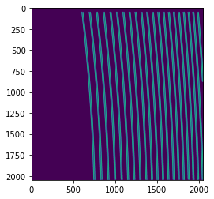

Tools for Mapping 1D Spectra to 2D Detector Images
==================================================

Sometimes we want to check the detector image corresponds to a point of
the extracted spectrum.

Preparations
~~~~~~~~~~~~

The first part is the same as the usual reduction process before assign
wavelength to the extracted spectrum. See the tutorial of IRD_stream for
more detail.

.. code:: ipython3

    from pyird.utils import irdstream
    import pathlib
    from pyird.image.bias import bias_subtract_image
    from pyird.image.hotpix import identify_hotpix_sigclip
    import astropy.io.fits as pyf
    
    # path
    basedir = pathlib.Path('~/pyird/data/20210317/').expanduser()
    
    ### FOR CALIBRATION ###
    # aperture extraction
    datadir = basedir/'flat/'
    anadir = basedir/'reduc/'
    flat=irdstream.Stream2D("flat",datadir,anadir)
    flat.fitsid=list(range(41704,41804,2)) ##FLAT_COMB
    
    ################################
    ### SELECT H band or YJ band ###
    ################################
    flat.band='h' #'h' or 'y'
    print(flat.band,' band')
    if flat.band=='h':
        flat.fitsid_increment() # when you use H-band
        trace_mmf=flat.aptrace(cutrow = 800,nap=42) #TraceAperture instance
    elif flat.band=='y':
        trace_mmf=flat.aptrace(cutrow = 1000,nap=102) #TraceAperture instance
    
    import matplotlib.pyplot as plt
    plt.imshow(trace_mmf.mask()) #apeture mask plot
    plt.show()
    
    # hotpixel mask
    datadir = basedir/'dark/'
    anadir = basedir/'reduc/'
    dark = irdstream.Stream2D('dark', datadir, anadir,fitsid=[43814])
    if flat.band=='h':
        dark.fitsid_increment() # when you use H-band
    for data in dark.rawpath:
        im = pyf.open(str(data))[0].data
    im_subbias = bias_subtract_image(im)
    hotpix_mask = identify_hotpix_sigclip(im_subbias)
    
    ###########################
    ### SELECT mmf2 or mmf1 ###
    ###########################
    trace_mmf.choose_mmf2_aperture() #mmf2 (star fiber)
    #trace_mmf.choose_mmf1_aperture() #mmf1 (comb fiber)
    
    # load ThAr raw image
    datadir = basedir/'thar'
    anadir = basedir/'reduc'
    if flat.band=='h':
        rawtag='IRDAD000'
    elif flat.band=='y':
        rawtag='IRDBD000'
    
    #wavelength calibration
    thar=irdstream.Stream2D("thar",datadir,anadir,rawtag=rawtag,fitsid=list(range(14632,14732)))
    thar.trace = trace_mmf
    thar.clean_pattern(extin='', extout='_cp', hotpix_mask=hotpix_mask)
    thar.calibrate_wavelength()
    
    ### TARGET ###
    # Load data
    datadir = basedir/'target/'
    anadir = basedir/'reduc/'
    target = irdstream.Stream2D(
        'targets', datadir, anadir, fitsid=[41510])
    if flat.band=='h':
        target.fitsid_increment() # when you use H-band
    target.info = True  # show detailed info
    target.trace = trace_mmf
    # clean pattern
    target.clean_pattern(extin='', extout='_cp', hotpix_mask=hotpix_mask)

.. parsed-literal::

    No fitsid yet.
    h  band
    median combine:  

.. parsed-literal::

    100%|████████████████████████████████████████████████████████████████████████████████████████████████████████████████| 50/50 [00:00<00:00, 349.53it/s]

.. parsed-literal::

    default nap value
    cross-section: row  1170

.. parsed-literal::

    100%|█████████████████████████████████████████████████████████████████████████████████████████████████████████████████| 42/42 [00:13<00:00,  3.19it/s]

.. image:: check_1Dto2D_files/check_1Dto2D_1_5.png

.. parsed-literal::

    100%|█████████████████████████████████████████████████████████████████████████████████████████████████████████████████| 42/42 [00:00<00:00, 96.71it/s]

.. parsed-literal::

    fitsid: [43814]
    hotpix mask = 0.45 percent
    fitsid: [14632, 14633, 14634, 14635, 14636, 14637, 14638, 14639, 14640, 14641, 14642, 14643, 14644, 14645, 14646, 14647, 14648, 14649, 14650, 14651, 14652, 14653, 14654, 14655, 14656, 14657, 14658, 14659, 14660, 14661, 14662, 14663, 14664, 14665, 14666, 14667, 14668, 14669, 14670, 14671, 14672, 14673, 14674, 14675, 14676, 14677, 14678, 14679, 14680, 14681, 14682, 14683, 14684, 14685, 14686, 14687, 14688, 14689, 14690, 14691, 14692, 14693, 14694, 14695, 14696, 14697, 14698, 14699, 14700, 14701, 14702, 14703, 14704, 14705, 14706, 14707, 14708, 14709, 14710, 14711, 14712, 14713, 14714, 14715, 14716, 14717, 14718, 14719, 14720, 14721, 14722, 14723, 14724, 14725, 14726, 14727, 14728, 14729, 14730, 14731]

.. parsed-literal::

    100%|█████████████████████████████████████████████████████████████████████████████████████████████████████████████████| 21/21 [00:00<00:00, 93.81it/s]

.. parsed-literal::

    Skipped 100 files because they already exists.

.. parsed-literal::

    0it [00:00, ?it/s]

.. parsed-literal::

    median combine:  _cp

.. parsed-literal::

    100%|█████████████████████████████████████████████████████████████████████████████████████████████████████████████| 100/100 [00:00<00:00, 1023.43it/s]
    /Users/yuikasagi/miniforge3/envs/py39_pip/lib/python3.9/site-packages/numpy/lib/nanfunctions.py:1218: RuntimeWarning: All-NaN slice encountered
      r, k = function_base._ureduce(a, func=_nanmedian, axis=axis, out=out,

.. parsed-literal::

    fitsid: [41510]
    clean_pattern: output extension=_cp

.. parsed-literal::

    100%|█████████████████████████████████████████████████████████████████████████████████████████████████████████████████| 21/21 [00:00<00:00, 98.50it/s]

.. parsed-literal::

    Ignore IRDA00041511.fits -> IRDA00041511_cp.fits

.. parsed-literal::

    0it [00:00, ?it/s]

Settings to display figures
~~~~~~~~~~~~~~~~~~~~~~~~~~~

You can set some parameters for plot(s). For example, you can get images
for several orders.

.. code:: ipython3

    import matplotlib
    matplotlib.use('tkagg')
    from pyird.utils.image_widget import image_1Dand2D
    import tkinter as tk
    
    ### SET PARAMETERS ###
    hotpix_mask = None # comment out this if you want to show hotpixels
    target.imcomb = False # set 'True' if you want to median combine images.
    wavcal_path = thar.anadir/('thar_%s_%s.fits'%(thar.band,thar.trace.mmf))
    
    ## additional parameters for plot
    vmin = -10
    vmax = 50
    scale = 'linear' # 'linear' or 'log'
    params = {'vmin':vmin,'vmax':vmax,'scale':scale}
    
    orders=[10,12] # orders to be plotted
    #######################
    
    ## Values needed for plotting
    rsd,wav,mask,pixcoord,rotim,iys_plot,iye_plot = target.flatten(extin='_cp',check=True,master_path=wavcal_path)

.. parsed-literal::

      0%|                                                                                                                           | 0/1 [00:00<?, ?it/s]
      0%|                                                                                                                          | 0/21 [00:00<?, ?it/s]
     24%|███████████████████████████▏                                                                                      | 5/21 [00:00<00:00, 48.04it/s]
     48%|█████████████████████████████████████████████████████▊                                                           | 10/21 [00:00<00:00, 44.36it/s]
     71%|████████████████████████████████████████████████████████████████████████████████▋                                | 15/21 [00:00<00:00, 43.07it/s]
    100%|█████████████████████████████████████████████████████████████████████████████████████████████████████████████████| 21/21 [00:00<00:00, 42.79it/s]
      0%|                                                                                                                           | 0/1 [00:00<?, ?it/s]

Case 1. Plot Absorption Lines
~~~~~~~~~~~~~~~~~~~~~~~~~~~~~

``show_spec_to_image()`` will create two figures in one window for each
order.

-  The upper figure is the spectrum of a order, and the lower figure is
   the detector image.
-  You can zoom up both image.
-  When you press any key on the spectrum, corresponding positions on
   the detector will be plotted as ‘x’.

**Note**:

If you run in jupyter notebook, add ``%matplolib notebook`` and comment
out ``root.mainloop()``.

.. code:: ipython3

    ## show 1d spectrum and 2d image
    %matplotlib notebook
    for order in orders:
        print(order)
        ## draw window
        root = tk.Tk()
        window = image_1Dand2D(root,order=order,band=flat.band)
        window.show_spec_to_image(rsd,wav,mask,pixcoord,rotim,iys_plot,iye_plot,wavcal_path=wavcal_path,hotpix_mask=hotpix_mask,**params)
    #root.mainloop()

.. parsed-literal::

    10

.. parsed-literal::

    <IPython.core.display.Javascript object>

.. raw:: html

    

.. parsed-literal::

    12

.. parsed-literal::

    <IPython.core.display.Javascript object>

.. raw:: html

    

Case 2. Plot Emission Lines
~~~~~~~~~~~~~~~~~~~~~~~~~~~

``show_emission_position()`` will be useful for the emission spectrum
(e.g. sky spectrum).

-  The upper figure is the detector image of one aperture, and the lower
   figure is the spectra of the order.
-  By fitting 2D gaussian to the emissions on the detector, the emission
   like signal and hotpixels are distinguished automatically.

**Note**:

If you run in jupyter notebook, add ``%matplolib notebook`` and comment
out ``root.mainloop()``.

.. code:: ipython3

    ## show positions of emissions on a detector image
    %matplotlib notebook
    for order in orders:
        ## draw window
        root2 = tk.Tk()
        window2 = image_1Dand2D(root2,order=order,band=flat.band)
        window2.show_emission_position(target,rsd,wav,mask,pixcoord,rotim,iys_plot,iye_plot,wavcal_path=wavcal_path,hotpix_mask=hotpix_mask,**params)
    #root2.mainloop()

.. parsed-literal::

    <IPython.core.display.Javascript object>

.. raw:: html

    

.. parsed-literal::

    WARNING: The fit may be unsuccessful; check fit_info['message'] for more information. [astropy.modeling.fitting]

.. parsed-literal::

    <IPython.core.display.Javascript object>

.. raw:: html

    

.. parsed-literal::

    WARNING: The fit may be unsuccessful; check fit_info['message'] for more information. [astropy.modeling.fitting]

