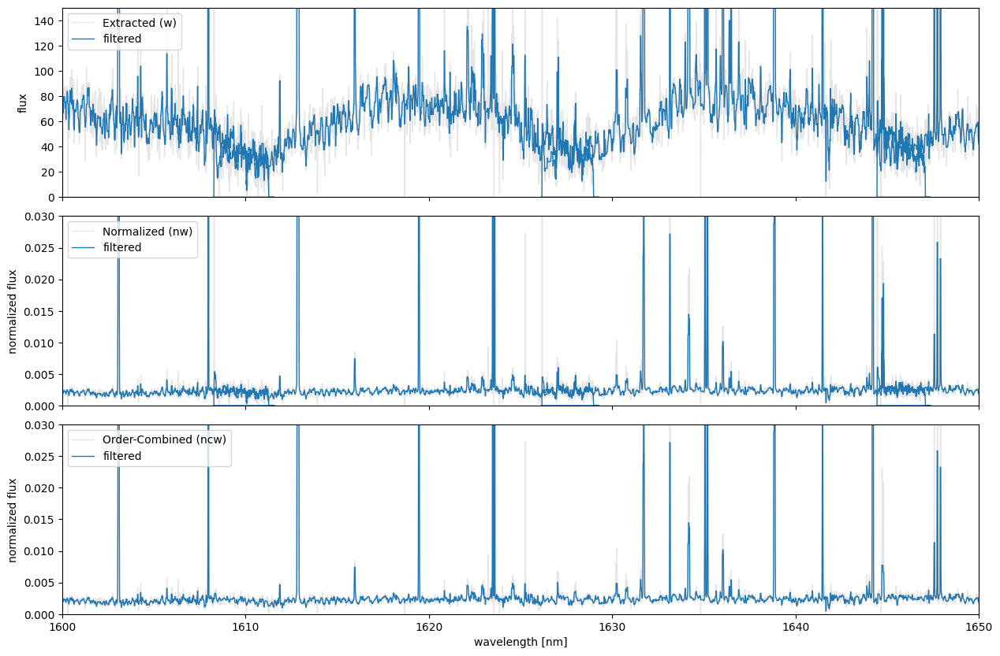

Output Spectra
==============

When running :doc:``./IRD_stream``, three types of 1D spectra are
generated:

- Wavelength calibrated 1D spectrum (\*\*’w…\_m?.dat’\*\*) with columns:
  ``$1: Wavelength [nm]``, ``$2: Order``, ``$3: Counts``.
- Normalized 1D spectrum (\*\*’nw…\_m?.dat’\*\*) with columns:
  ``$1: Wavelength [nm]``, ``$2: Order``, ``$3: Counts``, ``$4: S/N``,
  ``$5: Uncertainties``
- Order-combined normalized 1D spectrum (\*\*’ncw…\_m?.dat’\*\*) with
  columns: ``$1: Wavelength [nm]``, ``$2: Counts``, ``$3: S/N``,
  ``$4: Uncertainties``

.. note::

::

   - The normalized spectrum (nw) is obtained by dividing the extracted spectrum (w) by the blaze function (`wblaze_?_m?.dat`).
   - The order-combined spectrum (ncw) demonstrates an improved S/N in the wavelength region where adjacent orders overlap.

.. code:: ipython3

    import pathlib
    import pandas as pd
    from scipy.signal import medfilt
    
    import matplotlib.pyplot as plt

.. code:: ipython3

    basedir = pathlib.Path('~/pyird/data/20210317/').expanduser()
    anadir = basedir/'reduc/'
    
    fitsid_target = [41510]
    band = "h"
    mmf = "mmf2"
    if band=="h" and fitsid_target[0]%2==0:
        fitsid_target = [x+1 for x in fitsid_target]
    
    readargs = {"header": None, "sep": "\s+"}
    names = ["wavelength [nm]", "order", "counts", "sn_ratio", "uncertainty"]

.. parsed-literal::

    <>:10: SyntaxWarning: invalid escape sequence '\s'
    <>:10: SyntaxWarning: invalid escape sequence '\s'
    /var/folders/sb/rxwbk6kd4gldqpdvzxnhq4xm0000gn/T/ipykernel_11979/3404868316.py:10: SyntaxWarning: invalid escape sequence '\s'
      readargs = {"header": None, "sep": "\s+"}

The figure shows the target spectra extracted using ``PyIRD``.

.. note::

::

   - The sample dataset corresponds to the brown dwarf G196-3B.
   - The emission-like signals observed in the spectra are likely due to sky (airglow) emissions or hotpixels that were not masked.

.. code:: ipython3

    for fitsid in fitsid_target:
        # Extracted Spectrum: 
        # $1: wavelength [nm], $2: order, $3: counts
        wfile_path = anadir / f"w{fitsid}_{mmf[0]}{mmf[-1]}.dat"
        wspec = pd.read_csv(wfile_path, names = names[:3], **readargs)
    
        # Normalized Spectrum: 
        # $1: wavelength [nm], $2: order, $3: counts, $4: sn_ratio, $5: uncertainty
        nwfile_path = anadir / f"nw{fitsid}_{mmf[0]}{mmf[-1]}.dat"
        nwspec = pd.read_csv(nwfile_path, names = names, **readargs)
    
        # Order-combined Spectrum:
        # $1: wavelength [nm], $2: counts, $3: sn_ratio, $4: uncertainty
        ncwfile_path = anadir / f"ncw{fitsid}_{mmf[0]}{mmf[-1]}.dat"
        names_ncw = [x for i, x in enumerate(names) if i != 1]
        ncwspec = pd.read_csv(ncwfile_path, names = names_ncw, **readargs)
    
        # Plot
        fig, axs = plt.subplots(3, 1, figsize=(15,10), sharex=True)
        plt.subplots_adjust(hspace=0.1)
        labels = ["Extracted (w)", "Normalized (nw)", "Order-Combined (ncw)"]
        for i, spec in enumerate([wspec, nwspec, ncwspec]):
            axs[i].plot(spec["wavelength [nm]"], spec["counts"], lw=1, color="grey", alpha=0.2, label=labels[i])
            axs[i].plot(spec["wavelength [nm]"], medfilt(spec["counts"], 5), lw=1, label="filtered")
    
        for ax in axs:
            ax.legend(loc="upper left")
        axs[0].set(xlim=(1600, 1650),#(wspec["wavelength [nm]"].min(),wspec["wavelength [nm]"].max()), 
                   ylim=(0, 150),
                   ylabel="flux")
        axs[1].set(ylim=(0,0.03),
                   ylabel="normalized flux")
        axs[2].set(ylim=(0,0.03),
                   xlabel="wavelength [nm]",
                   ylabel="normalized flux")
        plt.show()

