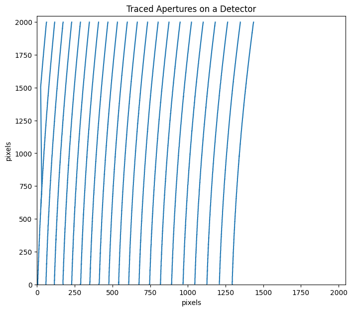

Handling Apertures
==================

.. code:: ipython3

    from pyird.utils import irdstream
    import pathlib

Single Fiber Mode (``nap = 21`` or ``nap = 51``)
------------------------------------------------

In some observations, only the star fiber (``mmf2``) is used, without
the comb (or speckle) fiber (``mmf1``). In such cases, extract the
desired apertures using ``aptrace`` with ``nap = 21`` for H-band images
or ``nap = 51`` for Y/J-band images.

.. code:: ipython3

    #--------SETTINGS--------#
    basedir = pathlib.Path('~/pyird/data/20210317/').expanduser()
    
    band = 'h' #'h' or 'y'
    mmf = 'mmf2' #'mmf1' (comb fiber) or 'mmf2' (star fiber)
    readout_noise_mode = "default" #'real' or 'default'
    
    datadir_flat = basedir/'flat/'
    anadir = basedir/'reduc/'
    
    fitsid_flat_star = list(range(41804,41904,2)) 
    #-------------------------#

.. code:: ipython3

    ## FLAT_STAR
    flat_star=irdstream.Stream2D("flat_star",datadir_flat,anadir)
    flat_star.fitsid=fitsid_flat_star.copy()
    # aperture extraction
    flat_star.band=band
    print(flat_star.band,' band')
    if band=='h' and flat_star.fitsid[0]%2==0:
        flat_star.fitsid_increment()
        trace_mmf=flat_star.aptrace(cutrow = 1500,nap=21) 
    elif band=='y':
        trace_mmf=flat_star.aptrace(cutrow = 1000,nap=51) 

.. parsed-literal::

    No fitsid yet.
    h  band
    fitsid incremented:  [41805, 41807, 41809, 41811, 41813, 41815, 41817, 41819, 41821, 41823, 41825, 41827, 41829, 41831, 41833, 41835, 41837, 41839, 41841, 41843, 41845, 41847, 41849, 41851, 41853, 41855, 41857, 41859, 41861, 41863, 41865, 41867, 41869, 41871, 41873, 41875, 41877, 41879, 41881, 41883, 41885, 41887, 41889, 41891, 41893, 41895, 41897, 41899, 41901, 41903]
    median combine:  

.. parsed-literal::

    100%|█████████████████████████████████████████████████████████████████████████████████████████████████████████████████████████████████████████████████| 50/50 [00:00<00:00, 1032.06it/s]
    /Users/yuikasagi/git/pyird/src/pyird/image/aptrace.py:251: UserWarning: Looks a single fiber aperture on the detector.
      warnings.warn("Looks a single fiber aperture on the detector.", UserWarning)

.. parsed-literal::

    cross-section: row  1502

.. image:: aptrace_flat_star_files/aptrace_flat_star_4_3.png

.. parsed-literal::

    100%|███████████████████████████████████████████████████████████████████████████████████████████████████████████████████████████████████████████████████| 21/21 [00:03<00:00,  6.35it/s]

Wavelength Calibration with User Defined Apertures (``nap < 20`` for H or ``nap < 51`` for YJ)
----------------------------------------------------------------------------------------------

If you want to extract apertures of your choice, you can use ``aptrace``
with an arbitrary value for ``nap``.

NOTE: Currently, only single fiber mode is supported. The use of both
fibers simultaneously is not accounted for.

Set ``ign_ord`` to specify the aperture orders you do not want to trace.
Ensure that the condition ``len(ign_ord) + nap = 21`` for H-band images
or ``len(ign_ord) + nap = 51`` for Y/J-band images is satisfied.

.. code:: ipython3

    ## FLAT_STAR
    flat_star_apcut=irdstream.Stream2D("flat_star_apcut",datadir_flat,anadir)
    flat_star_apcut.fitsid=fitsid_flat_star.copy()
    # aperture extraction
    flat_star_apcut.band=band
    print(flat_star_apcut.band,' band')
    if band=='h' and flat_star_apcut.fitsid[0]%2==0:
        flat_star_apcut.fitsid_increment()
        ign_ord = [2, 15]
        trace_mmf_apcut=flat_star_apcut.aptrace(cutrow = 1500,nap=19,ign_ord=ign_ord) 
    elif band=='y':
        ign_ord = [51]
        trace_mmf_apcut=flat_star_apcut.aptrace(cutrow = 1000,nap=50, ign_ord=ign_ord) 

.. parsed-literal::

    No fitsid yet.
    h  band
    fitsid incremented:  [41805, 41807, 41809, 41811, 41813, 41815, 41817, 41819, 41821, 41823, 41825, 41827, 41829, 41831, 41833, 41835, 41837, 41839, 41841, 41843, 41845, 41847, 41849, 41851, 41853, 41855, 41857, 41859, 41861, 41863, 41865, 41867, 41869, 41871, 41873, 41875, 41877, 41879, 41881, 41883, 41885, 41887, 41889, 41891, 41893, 41895, 41897, 41899, 41901, 41903]
    median combine:  

.. parsed-literal::

    100%|█████████████████████████████████████████████████████████████████████████████████████████████████████████████████████████████████████████████████| 50/50 [00:00<00:00, 1111.31it/s]
    /Users/yuikasagi/git/pyird/src/pyird/image/aptrace.py:253: UserWarning: nap is not default value. default: nap = 42 for H / 102 for YJ.
      warnings.warn(

.. parsed-literal::

    cross-section: row  1502

.. image:: aptrace_flat_star_files/aptrace_flat_star_6_3.png

.. parsed-literal::

    100%|███████████████████████████████████████████████████████████████████████████████████████████████████████████████████████████████████████████████████| 19/19 [00:03<00:00,  6.32it/s]

.. image:: aptrace_flat_star_files/aptrace_flat_star_6_5.png

Additionally, you must set ``channelfile_path`` when performing
``wavelength_calibration``.

For example, (1) if you want to ignore orders 2 and 15, create a new
channel file in the same format as ``channel_H.list``.

.. code:: ipython3

    import importlib
    import pandas as pd

.. code:: ipython3

    # load the prepared file
    channelfile_path_original = importlib.resources.files('pyird').joinpath('data/channel_H.list')
    df_pixwavmap_original = pd.read_csv(channelfile_path_original)
    df_pixwavmap_original

.. raw:: html

    

    
    <table border="1" class="dataframe">
      <thead>
        <tr style="text-align: right;">
          <th></th>
          <th>ORDER</th>
          <th>CHANNEL</th>
          <th>WAVELENGTH</th>
          <th>ST</th>
        </tr>
      </thead>
      <tbody>
        <tr>
          <th>0</th>
          <td>1</td>
          <td>905</td>
          <td>1417.25</td>
          <td>0</td>
        </tr>
        <tr>
          <th>1</th>
          <td>1</td>
          <td>970</td>
          <td>1417.86</td>
          <td>0</td>
        </tr>
        <tr>
          <th>2</th>
          <td>1</td>
          <td>1981</td>
          <td>1425.31</td>
          <td>0</td>
        </tr>
        <tr>
          <th>3</th>
          <td>2</td>
          <td>370</td>
          <td>1425.31</td>
          <td>0</td>
        </tr>
        <tr>
          <th>4</th>
          <td>2</td>
          <td>437</td>
          <td>1426.08</td>
          <td>0</td>
        </tr>
        <tr>
          <th>...</th>
          <td>...</td>
          <td>...</td>
          <td>...</td>
          <td>...</td>
        </tr>
        <tr>
          <th>63</th>
          <td>20</td>
          <td>1319</td>
          <td>1738.53</td>
          <td>0</td>
        </tr>
        <tr>
          <th>64</th>
          <td>20</td>
          <td>1333</td>
          <td>1738.67</td>
          <td>0</td>
        </tr>
        <tr>
          <th>65</th>
          <td>20</td>
          <td>1555</td>
          <td>1740.67</td>
          <td>0</td>
        </tr>
        <tr>
          <th>66</th>
          <td>21</td>
          <td>164</td>
          <td>1744.97</td>
          <td>0</td>
        </tr>
        <tr>
          <th>67</th>
          <td>21</td>
          <td>1289</td>
          <td>1758.93</td>
          <td>0</td>
        </tr>
      </tbody>
    </table>
    
68 rows × 4 columns

    

.. code:: ipython3

    # Get indices to be dropped
    mask_ind = df_pixwavmap_original[df_pixwavmap_original["ORDER"].isin(ign_ord)].index
    
    # Drop the specified rows
    df_pixwavmap_new = df_pixwavmap_original.drop(index=mask_ind)
    df_pixwavmap_new

.. raw:: html

    

    
    <table border="1" class="dataframe">
      <thead>
        <tr style="text-align: right;">
          <th></th>
          <th>ORDER</th>
          <th>CHANNEL</th>
          <th>WAVELENGTH</th>
          <th>ST</th>
        </tr>
      </thead>
      <tbody>
        <tr>
          <th>0</th>
          <td>1</td>
          <td>905</td>
          <td>1417.25</td>
          <td>0</td>
        </tr>
        <tr>
          <th>1</th>
          <td>1</td>
          <td>970</td>
          <td>1417.86</td>
          <td>0</td>
        </tr>
        <tr>
          <th>2</th>
          <td>1</td>
          <td>1981</td>
          <td>1425.31</td>
          <td>0</td>
        </tr>
        <tr>
          <th>6</th>
          <td>3</td>
          <td>689</td>
          <td>1442.85</td>
          <td>0</td>
        </tr>
        <tr>
          <th>7</th>
          <td>3</td>
          <td>960</td>
          <td>1445.57</td>
          <td>1</td>
        </tr>
        <tr>
          <th>...</th>
          <td>...</td>
          <td>...</td>
          <td>...</td>
          <td>...</td>
        </tr>
        <tr>
          <th>63</th>
          <td>20</td>
          <td>1319</td>
          <td>1738.53</td>
          <td>0</td>
        </tr>
        <tr>
          <th>64</th>
          <td>20</td>
          <td>1333</td>
          <td>1738.67</td>
          <td>0</td>
        </tr>
        <tr>
          <th>65</th>
          <td>20</td>
          <td>1555</td>
          <td>1740.67</td>
          <td>0</td>
        </tr>
        <tr>
          <th>66</th>
          <td>21</td>
          <td>164</td>
          <td>1744.97</td>
          <td>0</td>
        </tr>
        <tr>
          <th>67</th>
          <td>21</td>
          <td>1289</td>
          <td>1758.93</td>
          <td>0</td>
        </tr>
      </tbody>
    </table>
    
63 rows × 4 columns

    

(2) Save ``df_pixwavmap_new`` to somewhere.

::

   channelfile_path_new = "/path/to/save/new_channelfile.list"

   df_pixwavmap_new.to_csv(channelfile_path_new, index=False)

(3) Do not forget to set ``channelfle_path``.

::

   thar.calibrate_wavelength(channelfile_path=channelfile_path_new, ign_ord=ign_ord)
