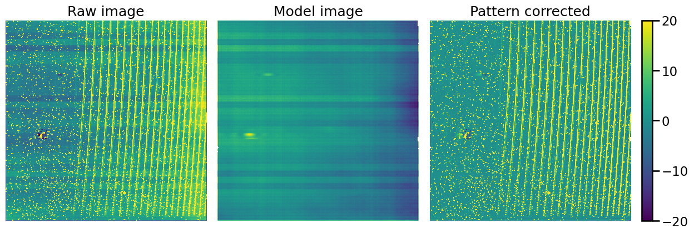
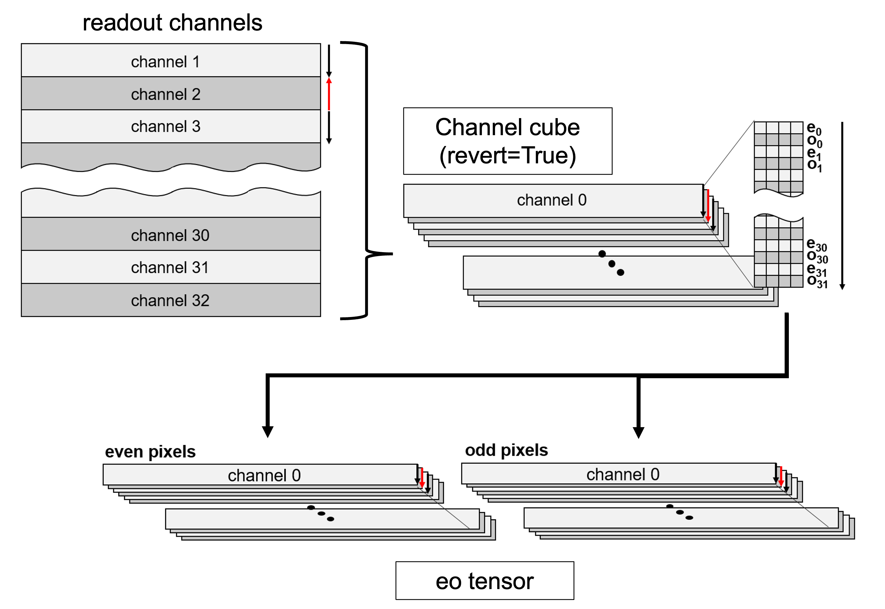

Readout Noise Pattern Model
============================

What is the readout noise pattern?
--------------------------------

Raw (left), the readout pattern model using ``median_XY_profile`` (middle), and its pattern-corrected image (right).

Divide into `channel cubes` and `eo tensor`
--------------------------------------------

- channel cube:
    - The H2RG detector has 32 channels.
    - The readout direction is opposite in even and odd channels.
- eo tensor:
    - There also exist a strong dependence of noise pattern on even or odd *pixel* numbers.

Create a pattern model
-----------------------

- 2d-gp
- median
- stripe
	  
	  
